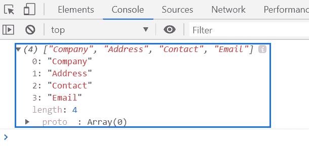

# 下划线. js _。所有按键()功能

> 原文:[https://www . geesforgeks . org/下划线-js-_-allkeys-function/](https://www.geeksforgeeks.org/underscore-js-_-allkeys-function/)

**_。allKeys()** 函数用于返回对象的所有键和继承的属性。

**语法:**

```
_.allKeys( object )
```

**参数:**该功能接受如上所述的单个参数，如下所述:

*   **对象:**包含保存键值对元素的对象元素。

**返回值:**返回对象的所有键和继承的属性。

下面的例子说明了 **_。allKeys()** 函数在下划线. js 中:

**例 1:**

```
<!DOCTYPE html>
<html>

<head>
    <script type="text/javascript" src=
"https://cdnjs.cloudflare.com/ajax/libs/underscore.js/1.9.1/underscore-min.js">
    </script>
</head>

<body>
    <script type="text/javascript">

        var obj = {
            Company: "GeeksforGeeks",
            Address: "Noida",
            Contact: "+91 9876543210",
            Email: "abc@gfg.com"
        }
        console.log(_.allKeys(obj));
    </script>
</body>

</html>
```

**输出:**


**例 2:**

```
<!DOCTYPE html>
<html>

<head>
    <script type="text/javascript" src=
"https://cdnjs.cloudflare.com/ajax/libs/underscore.js/1.9.1/underscore-min.js">
    </script>
</head>

<body>
    <script type="text/javascript">

        function Geeks(name) {
            return this.name = name;
        }

        Geeks.prototype.GeeksforGeeks = true;

        console.log(_.allKeys(new Geeks("Company")));
    </script>
</body>

</html>
```

**输出:**
