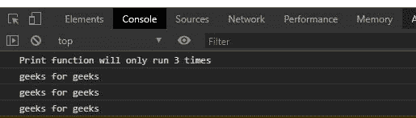
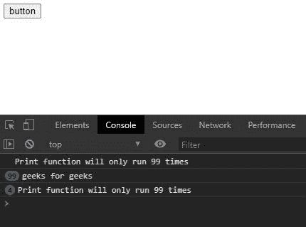

# 下划线. js _。之前()功能

> 原文:[https://www . geesforgeks . org/下划线-js-_-先于-function/](https://www.geeksforgeeks.org/underscore-js-_-before-function/)

**_。before()** 函数在下划线. js 中用于调用特定函数特定次数。它使用一个计数变量来记录函数被调用的次数。

**语法:**

```
_.before(count, function)
```

**参数:**

*   **计数:**是函数被调用的次数。
*   **功能:**是运行计数次数的功能。

**返回:**该函数返回函数调用的计数。

**注意:**请在浏览器中通过代码直接使用该代码之前，先链接下划线 CDN。

**例 1:**

```
<!DOCTYPE html> 
<html> 
  <head> 
    <script src =  
"https://cdnjs.cloudflare.com/ajax/libs/underscore.js/1.9.1/underscore-min.js" > 
    </script> 
  </head> 
  <body> 
    <script>
      let print=()=>{
        console.log("geeks for geeks")
      }
      console.log(`Print function will only run 3 times`)
      //the print function cannot run more than 3 times
      count=_.before(4, print);
      //calling count function more than 3 times
      count();
      count();
      count();
      count();
      count();
      count();
      count();
    </script>
  </body> 
</html>
```

**输出:**



**例 2:**

从示例中可以清楚地看到，如果一次又一次地点击按钮，打印功能将无法工作，因为它已经达到了计数。

```
<!DOCTYPE html> 
<html> 
  <head> 
    <script src =  
"https://cdnjs.cloudflare.com/ajax/libs/underscore.js/1.9.1/underscore-min.js" > 
    </script> 
   </head> 
  <body> 
    <button id="btn">button</button>
    <script>
      let print=()=>{
        console.log("geeks for geeks")
      }
      //the print function cannot run more than 99 times
      count=_.before(100, print);
      //calling count function more than 99 times
      let btn=document.querySelector("#btn");
      let run=()=>{
      console.log(`Print function will only run 99 times`)
        for(let i=0; i<5000; i++){
          count()
        }
      }
      btn.addEventListener("click", run)
    </script>
  </body> 
</html>
```

**输出:**

