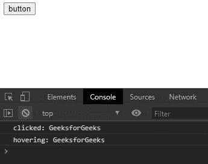

# 下划线. js _。bindAll()函数

> 原文:[https://www . geesforgeks . org/下划线-js-_-bindall-function/](https://www.geeksforgeeks.org/underscore-js-_-bindall-function/)

**BindAll()** 函数在下划线. js 中用于绑定对象上的方法数量。每个方法都有一个方法名。使用事件处理程序很方便。

**语法:**

```
_.bindAll(object, *methodNames)
```

**参数:**

*   **对象:**是包含不同方法和功能需要绑定的对象。
*   **方法名称:**是对象中存在的方法的名称。

**返回值:**不返回任何内容。

**注意:**请在浏览器中通过代码直接使用该代码之前，先链接下划线 CDN。

**例 1:**

```
<!DOCTYPE html> 
<html> 
  <head> 
    <script src =  
"https://cdnjs.cloudflare.com/ajax/libs/underscore.js/1.9.1/underscore-min.js" > 
    </script> 
  </head> 
  <body> 
    <button id="button">button</button>
    <script type="text/javascript"> 
      var object={
          label  : 'GeeksforGeeks',
          click: function(){ console.log(
                'clicked: ' + this.label); },
          hover: function(){ console.log(
               'hovering: ' + this.label); }
        };
        //using bindall function of underscorejs
        _.bindAll(object, 'click', 'hover');
        /* When the button is clicked, 
           this.label will have the correct value.*/
        let btn=document.querySelector("#button");
        btn.addEventListener('click', object.click);
        btn.addEventListener('click', object.hover);
    </script> 
  </body> 
</html>
```

**输出:**



**例 2:**

```
<!DOCTYPE html> 
<html> 
  <head> 
    <script src =  
"https://cdnjs.cloudflare.com/ajax/libs/underscore.js/1.9.1/underscore-min.js" > 
    </script> 
  </head> 
  <body> 
    <button id="button">button</button>
    <script type="text/javascript"> 
      var object={
          printNum:()=>{
            for(let i=0; i<5; i++)
                console.log(i+" geeksforgeeks")
          },
          func: function(){ console.log(
              'Function : ' + this.printNum); },
          output: function(){ "Output : "+this.printNum(); }
        };
        //using bindall function of underscorejs
        _.bindAll(object, 'func', 'output');
        // When the button is clicked 
        let btn=document.querySelector("#button");
        btn.addEventListener('click', object.func);
        btn.addEventListener('click', object.output);
    </script> 
  </body> 
</html>
```

**输出:**

