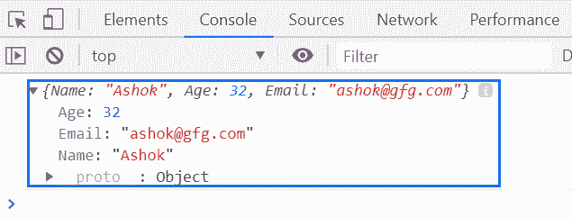

# 下划线. js | _。克隆()功能

> 原文:[https://www . geesforgeks . org/下划线-js-_-克隆-函数/](https://www.geeksforgeeks.org/underscore-js-_-clone-function/)

**_。clone()函数**用于创建给定对象的浅拷贝。嵌套对象或数组将使用引用进行复制，而不是复制。

**语法:**

```
_.clone( object )
```

**参数:**该函数接受如上所述的单个参数，如下所述:

*   **对象:**包含需要复制的对象的值。

**返回值:**返回给定对象的浅拷贝。

下面举例说明 **_。克隆()函数【下划线中的 T1:
**示例 1:****

```
<!DOCTYPE html>
<html>

<head>
    <script type="text/javascript" src=
"https://cdnjs.cloudflare.com/ajax/libs/underscore.js/1.9.1/underscore-min.js">
    </script>
</head>

<body>
    <script type="text/javascript">

        var info = {
            Company: 'GeeksforGeeks',
            Address: 'Noida',
            Contact: '+91 9876543210'
        };

        console.log(_.clone(info));
    </script>
</body>

</html>
```

**输出:**


**例 2:**

```
<!DOCTYPE html>
<html>

<head>
    <script type="text/javascript" src=
"https://cdnjs.cloudflare.com/ajax/libs/underscore.js/1.9.1/underscore-min.js">
    </script>
</head>

<body>
    <script type="text/javascript">

        var clon = _.clone({
            Name: 'Ashok',
            Age: 32,
            Email: 'ashok@gfg.com'
        });

        console.log(clon);
    </script>
</body>

</html>
```

**输出:**
