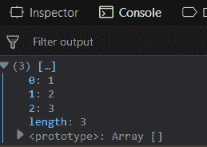
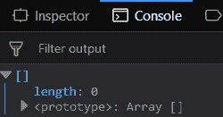
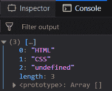
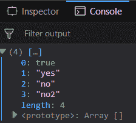

# 下划线. js _。紧凑型()功能

> 原文:[https://www . geesforgeks . org/下划线-js-_-紧凑-函数/](https://www.geeksforgeeks.org/underscore-js-_-compact-function/)

_。compact()函数是 JavaScript 的下划线. js 库中的一个内置函数，用于在移除所有错误值后返回一个数组。JavaScript 中的 false 值是 NaN、undefined、false、0、null 或空字符串。它的输出是一个包含所有偶数值的数组，比如数组的元素、数字、字母、字符、true 等。

**语法:**

```
_.compact( list ) 

```

**参数:**该函数包含单个参数*列表*，该列表保存包含真假元素的数组。
**返回值:**返回一个只包含真值的数组。

**将真元素和假元素的列表传递给 _。compact()函数:** The _。compact()函数从逐个获取元素开始，然后检查它是否是假元素。如果它是 false 元素，那么它将忽略该元素。否则，它会将真元素添加到结果数组中。这里的 false 元素表示为 false，空字符串表示为”。

**示例:**

## 超文本标记语言

```
<!DOCTYPE html>
<html>
    <head>
        <script src = 
"https://cdnjs.cloudflare.com/ajax/libs/underscore.js/1.9.1/underscore-min.js" >
        </script>
    </head>
    <body>
        <script type="text/javascript">
            console.log(_.compact([0, 1, false, 2, '', 3]));
        </script>
    </body>
</html>                    
```

**输出:**



**将包含所有错误值的列表传递给 _。compact()函数:**如果传递的数组包含所有的假元素，那么 _。compact()函数也将同样工作。它将检查每个元素，因为它们都是假的，所以所有的元素都将被忽略。因此，最终形成的数组将没有任何元素，其长度将为 0。

**示例:**

## 超文本标记语言

```
<!DOCTYPE html>
<html>
    <head>
        <script src = 
"https://cdnjs.cloudflare.com/ajax/libs/underscore.js/1.9.1/underscore-min.js" >
        </script>
    </head>
    <body>
        <script type="text/javascript">
            console.log(_.compact([0, false, '', undefined, NaN]));
        </script>
    </body>
</html>                    
```

**输出:**



**在“to _”中传递一个包含假元素的列表。compact()函数:**传递一个 false 元素，在“undefined”内部作为“undefined”。虽然这是一个错误的元素，但由于它是在内部给出的”，因此它被视为一个字符元素。因此，它不再是一个虚假的元素。Rest 的工作原理同上。

**示例:**

## 超文本标记语言

```
<!DOCTYPE html>
<html>
    <head>
        <script src = 
"https://cdnjs.cloudflare.com/ajax/libs/underscore.js/1.9.1/underscore-min.js" >
        </script>
    </head>
    <body>
        <script type="text/javascript">
            console.log(_.compact([false, 'HTML', NaN,
                       'CSS', 'undefined']));
        </script>
    </body>
</html>                    
```

**输出:**



**将包含修改后的错误值的列表传递给 _。compact()函数:**数组包含一个作为 true 的元素，该元素包含在结果数组中。“no”元素也包括在内，因为它在“内部”，这使它成为一个字符。此外，如果通过“no2 ”,它也不会被 _。compact()函数。

**示例:**

## 超文本标记语言

```
<!DOCTYPE html>
<html>
    <head>
        <script src = 
"https://cdnjs.cloudflare.com/ajax/libs/underscore.js/1.9.1/underscore-min.js" >
        </script>
    </head>
    <body>
        <script type="text/javascript">
            console.log(_.compact([false, true, 'yes', 'no', "no2"]));
        </script>
    </body>
</html>                    
```

**输出:**



**注意:**这些命令在 Google 控制台或 Firefox 中无法工作，因为需要添加这些他们没有添加的附加文件。因此，将给定的链接添加到您的 HTML 文件中，然后运行它们。

## 超文本标记语言

```
<script type="text/javascript" src =  
"https://cdnjs.cloudflare.com/ajax/libs/underscore.js/1.9.1/underscore-min.js">  
</script> 
```