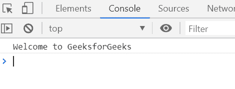

# 下划线. js _。撰写()功能

> 原文:[https://www . geesforgeks . org/下划线-js-_-compose-function/](https://www.geeksforgeeks.org/underscore-js-_-compose-function/)

**_。compose()** 函数用于返回函数列表的组成。函数列表返回后面函数的值。

**语法:**

```
_.compose(*functions)
```

**参数:**该函数接受如上所述的单个参数，如下所述:

*   **功能:**包含要执行的功能列表。

**返回值:**返回函数列表的组成。

下面的例子说明了 **_。下划线中的 compose()** 函数:

**例 1:**

```
<!DOCTYPE html>
<html>

<head>
    <script type="text/javascript" src=
"https://cdnjs.cloudflare.com/ajax/libs/underscore.js/1.9.1/underscore-min.js">
    </script>
</head>

<body>
    <script type="text/javascript">
        var fun1 = function (addString) {
            return "Welcome to " + addString;
        };

        var fun2 = function (GFG) {
            return GFG;
        };
        var str = _.compose(fun1, fun2);

        console.log(str('GeeksforGeeks'));
    </script>
</body>

</html>
```

**输出:**


**例 2:**

```
<!DOCTYPE html>
<html>

<head>
    <script type="text/javascript" src=
"https://cdnjs.cloudflare.com/ajax/libs/underscore.js/1.9.1/underscore-min.js">
    </script>
</head>

<body>
    <script type="text/javascript">
        var fun1 = function (str1) {
            return 'Welcome' + str1 +
                '\nA computer science portal';
        };

        var fun2 = function (str2) {
            return ' to ' + str2.toLowerCase();
        };
        var str = _.compose(fun1, fun2);

        console.log(str('GEEKSFORGEEKS'));
    </script>
</body>

</html>
```

**输出:**
