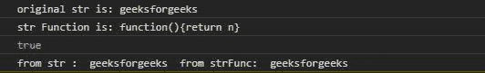
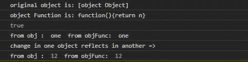

# 下划线. js _。常数()功能

> 原文:[https://www . geesforgeks . org/下划线-js-_-常量-函数/](https://www.geeksforgeeks.org/underscore-js-_-constant-function/)

**下划线. js** 是一个 JavaScript 库，使得对数组、字符串、对象的操作变得更加容易和便捷。 **_。constant()** 函数用于创建一个返回给它的参数的函数。几乎和 _。identity()函数。

**注意:**在浏览器中使用下划线功能之前，链接下划线 CDN 是非常必要的。链接下划线. js CDN 时，“_”作为全局变量附加到浏览器。

**语法:**

```
_.constant( object );
```

**参数:**此功能接受单参数对象。

**返回值:**该函数返回给函数的参数。

下面的例子说明了 _。下划线中的常量()函数:

**例 1:**

```
<!DOCTYPE html>
<html>

<head>
    <script src=
"https://cdnjs.cloudflare.com/ajax/libs/underscore.js/1.9.1/underscore-min.js">
    </script>
</head>

<body>
    <script>

        let str = "geeksforgeeks"

        // _.constant function of underscore.js
        let strFunc = _.constant(str);
        console.log(`original str is: ${str}`)
        console.log(`str Function is: ${strFunc}`)

        // This will return true
        console.log(str === strFunc())

        // Both strings are exactly same
        console.log("from str : ", str, 
            " from strFunc: ", strFunc());
    </script>
</body>

</html>
```

**输出:**



**例 2:**

```
<!DOCTYPE html>
<html>

<head>
    <script src=
"https://cdnjs.cloudflare.com/ajax/libs/underscore.js/1.9.1/underscore-min.js">
    </script>
</head>

<body>
    <script>

        // Creating a object
        let obj = {
            "a": "one",
            "b": "two",
            "c": "three"
        }

        // _.constant function of underscore.js
        let objFunc = _.constant(obj);
        console.log(`original object is: ${obj}`)
        console.log(`object Function is: ${objFunc}`)

        // This will return true
        console.log(obj === objFunc())

        // Both objects are exactly same
        console.log("from obj : ", obj.a, 
            " from objFunc: ", objFunc().a);

        // Made Changes in object
        obj.a = 12

        // Change in one object reflects
        // in another
        console.log("change in one object "
                + "reflects in another =>")

        console.log("from obj : ", obj.a, 
            " from objFunc: ", objFunc().a);
    </script>
</body>

</html>
```

**输出:**

