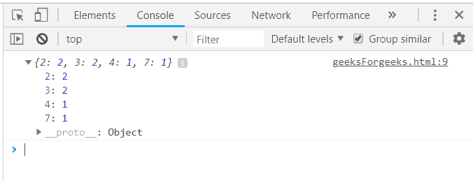
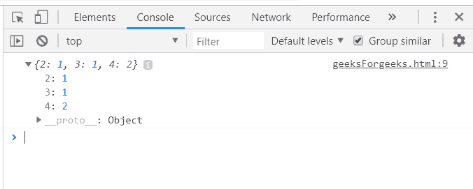
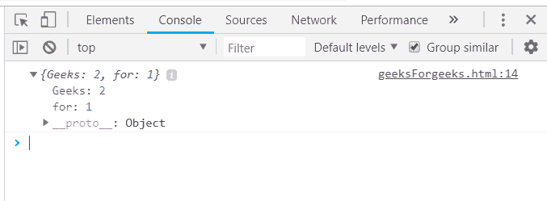
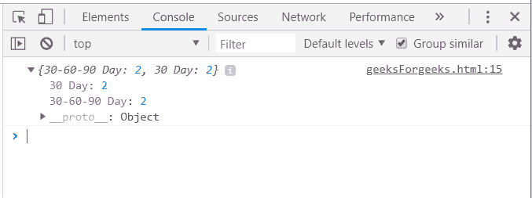

# 下划线. js _。计数功能

> 原文:[https://www . geesforgeks . org/下划线-js-_-countby-function/](https://www.geeksforgeeks.org/underscore-js-_-countby-function/)

下划线. js 是一个 JavaScript 库，它提供了许多有用的函数，在很大程度上有助于编程，比如映射、过滤、调用等，甚至不使用任何内置对象。
The _。countBy()函数用于将列表分成多个组，并返回每个组中对象数量的计数。它通过匹配每个元素的值来工作。如果它们匹配，则一个集合的计数增加 1，否则具有该值的另一个集合/组的计数增加 1。它还可以根据谁的结果传递一个函数来收集元素并增加每个组的计数。它既可以根据数字匹配，也可以根据字符串匹配。

**语法:**

```
_.countBy(list, iteratee, [context]) 
```

**参数:**该功能接受三个参数，如上所述，描述如下:

*   **列表:**此参数用于保存项目列表。
*   **迭代:**该参数用于保持测试条件。
*   **上下文:**需要显示的文本内容。

**返回值:**它将集合作为不同的数组返回。

**将 Math.ceil()函数传递给 _。countBy()函数:** The _。countBy()函数从列表中一个接一个地获取元素，并将其传递给这里提到的另一个函数。这里的函数是取每个数字的上限并返回它的值。所以，数组的所有值都是在取完它们的上限后一个接一个地计数，然后根据它们是相同还是不同来计数。

**示例:**

```
<html>
    <head>
        <script type="text/javascript" src=
        "https://cdnjs.cloudflare.com/ajax/libs/underscore.js/1.9.1/underscore.js">
        </script>
    </head>
    <body>
        <script type="text/javascript">
        console.log(_.countBy([2.7, 3.4, 6.6, 1.2, 2.0, 2.4],
                   function(num){ return Math.ceil(num); }));
        </script>
    </body>
</html>                    
```

**输出:**


**使用 _ 中的长度()。countBy()函数:**将数组元素传递给 countBy()函数。然后，找出每个元素的长度，并收集相同的长度。最后，显示每个集合的计数以及沿左侧的相应长度。

**示例:**

```
<html>
    <head>
        <script type="text/javascript" src=
        "https://cdnjs.cloudflare.com/ajax/libs/underscore.js/1.9.1/underscore.js">
        </script>
    </head>
    <body>
        <script type="text/javascript">
           console.log(_.countBy(['HTML', 'CSS3', 'JS', 'PHP'], 'length'));
        </script>
    </body>
</html>
```

**输出:**


**使用传入的数组的一个属性。countBy()函数:**首先声明数组(这里数组是‘arr’)。选择一个需要计算的条件，如这里的“prop3”。那么在“prop3”中具有相同值的元素将被分组到一个集合中。最终结果将包含左侧的 prop3 以及右侧的计数。就像在 prop3 中，“极客”要来两次，所以它的计数将是 2。记录最终答案。

**示例:**

```
<html>
    <head>
        <script type="text/javascript" src=
        "https://cdnjs.cloudflare.com/ajax/libs/underscore.js/1.9.1/underscore.js">
        </script>
    </head>
    <body>
        <script type="text/javascript">
            var arr =  [
                {prop1:"10", prop2:"07", prop3: "Geeks"},
                {prop1:"12", prop2:"86", prop3: "for"},
                {prop1:"11", prop2:"58", prop3: "Geeks"} 
            ];
           console.log(_.countBy(arr, 'prop3'));
        </script>
    </body>
</html>
```

**输出:**


**将“日期”作为数组的属性传递给 _。countBy()函数:首先定义一个数组，其中一个属性是格式为“dd-mm-yy”的“date”。然后将数组和' date '属性传递给 _。countBy()函数。具有相同日期的元素将被分组为一个集合，然后每个组的计数将显示在结果中。**

**示例:**

```
<html>
    <head>
        <script type="text/javascript" src=
        "https://cdnjs.cloudflare.com/ajax/libs/underscore.js/1.9.1/underscore.js">
        </script>
    </head>
    <body>
        <script type="text/javascript">
            var orders = [
                {    date:"30-60-90 Day", Name:"Kim", amount:415     },
                {   date:"30-60-90 Day", Name:"Kelly", amount:175     },
                {   date:"30 Day", Name:"Shelly", amount:400     },
                {   date:"30 Day", Name:"Sarvesh", amount:180     }
                ];
            console.log(_.countBy(orders, "date"));
        </script>
    </body>
</html>
```

**输出:**


**注意:**这些命令在 Google 控制台或 Firefox 中无法工作，因为需要添加这些他们没有添加的附加文件。因此，将给定的链接添加到您的 HTML 文件中，然后运行它们。

```
<script type="text/javascript" src =
"https://cdnjs.cloudflare.com/ajax/libs/underscore.js/1.9.1/underscore-min.js">
</script>
```