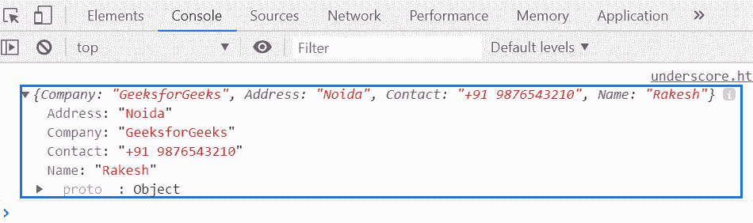
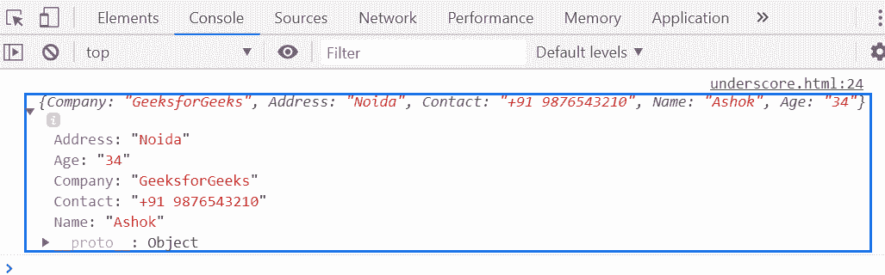

# 下划线. js | _。默认值()功能

> 原文:[https://www . geesforgeks . org/下划线-js-_-默认值-函数/](https://www.geeksforgeeks.org/underscore-js-_-defaults-function/)

**_。defaults()函数**在用以下默认对象列表中的第一个值填充对象的未定义属性后返回该对象。

**语法:**

```
_.defaults(object, *defaults)
```

**参数:**该函数接受两个参数，如上所述，如下所述:

*   **对象:**此参数保存对象的值。
*   **默认值:**为可选参数。它包含对象的[键，值]对。

**返回值:**用以下默认对象列表中的第一个值填充未定义的属性后，返回对象。

**例 1:**

```
<!DOCTYPE html>
<html>

<head>
    <script type="text/javascript" src=
"https://cdnjs.cloudflare.com/ajax/libs/underscore.js/1.9.1/underscore-min.js">
    </script>
</head>

<body>
    <script type="text/javascript">

        var info = {
            Company: 'GeeksforGeeks',
            Address: 'Noida',
            Contact: '+91 9876543210'
        };

        console.log(_.defaults(info,
            {
                Contact: '+91 9898989898',
                Name: 'Rakesh'
            })
        );
    </script>
</body>

</html>
```

**输出:**


**例 2:**

```
<!DOCTYPE html>
<html>

<head>
    <script type="text/javascript" src=
"https://cdnjs.cloudflare.com/ajax/libs/underscore.js/1.9.1/underscore-min.js">
    </script>
</head>

<body>
    <script type="text/javascript">

        var info = {
            Company: 'GeeksforGeeks',
            Address: 'Noida',
            Contact: '+91 9876543210'
        };

        var def = {
            Name: 'Ashok',
            Age: '34',
            Company: 'GFG'
        }

        console.log(_.defaults(info, def));
    </script>
</body>

</html>
```

**输出:**
