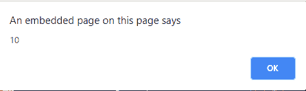
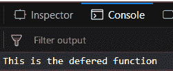
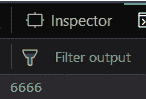

# 下划线. js _。延期()功能

> 原文:[https://www . geesforgeks . org/下划线-js-_-delay-function/](https://www.geeksforgeeks.org/underscore-js-_-defer-function/)

下划线. js 是一个 JavaScript 库，它提供了很多有用的功能，比如映射、过滤、调用等，甚至不使用任何内置对象。
The _。defer()函数用于调用/调用一个函数，直到当前调用堆栈被清除。它的主要优点是，它执行昂贵的计算，计算或大块的 HTML，而不会阻止用户界面线程更新。它具有类似于 setTimeOut()函数的功能，延迟为 0。传递给该函数的函数将首先被调用。
调用栈是一种解释器机制，就像 JavaScript 解释器一样，用于跟踪它在调用多个函数的脚本中的位置。
**语法:**

```
_.defer(function, *arguments)
```

**参数:**
需要两个参数:

*   函数
*   参数(可选)

**返回值:**
它不返回值，而是执行传递的函数。

1.  **将 alert()函数传递给 _。defer()函数:**
    The _。deferre()函数首先检查当前调用堆栈。如果清除，则将执行传递的 alert()函数，并显示传递给它的字符串“这是延迟函数”。但是，如果当前调用堆栈没有被清除，并且有一些其他的作业要执行，那么 alert()函数将不会被立即调用，而是需要等到堆栈变空。
    **示例:**

## 超文本标记语言

```
<html>

<head>
    <script src=
"https://cdnjs.cloudflare.com/ajax/libs/underscore.js/1.9.1/underscore-min.js">
  </script>
</head>

<body>
    <script type="text/javascript">
        _.defer(function() {
            alert('This is the deferred function');
        });
    </script>
</body>

</html>
```

1.  **输出:**


2.  **使用 _，执行加法。defer()函数:**
    我们可以使用 _，执行各种数学运算。defer()函数。就像这里，我们正在执行 7 和 3 的加法，然后提醒它。将遵循同样的程序。首先，将检查当前调用堆栈。如果它不为空，则不会调用其他函数。但是如果全部清除，那么报警功能将被调用，显示 7 和 3 相加，即 10。
    **例:**

## 超文本标记语言

```
<html>

<head>
    <script src=
"https://cdnjs.cloudflare.com/ajax/libs/underscore.js/1.9.1/underscore-min.js">
  </script>
</head>

<body>
    <script type="text/javascript">
        _.defer(function() {
            alert(7 + 3);
        });
    </script>
</body>

</html>
```

1.  **输出:**



1.  **将 console.log()函数传递给 _。deferre()函数:**
    我们甚至可以使用像 console.log()函数这样的其他函数。_。defer()函数将检查调用堆栈是否为空。如果它不是空的，那么 console.log()函数将不会被调用。否则，控制台上将显示“这是延迟功能”。
    **例:**

## 超文本标记语言

```
<html>

<head>
    <script src=
"https://cdnjs.cloudflare.com/ajax/libs/underscore.js/1.9.1/underscore-min.js">
  </script>
</head>

<body>
    <script type="text/javascript">
        _.defer(function() {
            console.log('This is the deferred function');
        });
    </script>
</body>

</html>
```

1.  **输出:**



2.  **对 _，执行加法运算。defer()函数:**
    我们甚至可以对 console.log()函数执行加法操作。就像这里，我们正在执行 1000 和 5666 的加法。如果调用栈为空，那么将显示“6666”(1000+5666)，否则将不调用任何函数。
    **例:**

## 超文本标记语言

```
<html>

<head>
    <script src=
"https://cdnjs.cloudflare.com/ajax/libs/underscore.js/1.9.1/underscore-min.js">
  </script>
</head>

<body>
    <script type="text/javascript">
        _.defer(function() {
            console.log(1000 + 5666);
        });
    </script>
</body>

</html>
```

1.  **输出:**



**注意:**
这些命令在 Google 控制台或 firefox 中无法工作，因为这些额外的文件需要添加，而它们没有添加。
因此，将给定的链接添加到您的 HTML 文件中，然后运行它们。
链接如下:

## 超文本标记语言

```
<script type="text/javascript" src =
"https://cdnjs.cloudflare.com/ajax/libs/underscore.js/1.9.1/underscore-min.js">
</script>
```