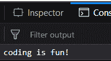
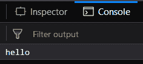
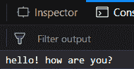
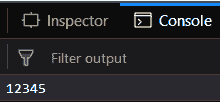

# 下划线. js _。延迟()功能

> 原文:[https://www . geesforgeks . org/下划线-js-_-延迟-函数/](https://www.geeksforgeeks.org/underscore-js-_-delay-function/)

**_。delay()函数在等待指定的毫秒数后执行其参数中提到的函数。它主要用于当我们想执行某项任务，但经过一定时间后。在这种情况下，我们可以定义这个函数，然后它将在等待毫秒后执行。如果我们也将参数传递给这个函数(它是可选传递的)，那么这些参数将作为传递给 _)的函数的参数。delay()函数。**

****语法:****

 **```
_.delay(function, wait, *arguments)
```** 

**参数:**需要三个参数:

*   **功能:**要执行的**功能**。
*   **等待:**函数需要执行的时间(毫秒)
*   ***参数:**传递给 _ _ 的函数的参数。延迟()功能(可选)

**返回值:**返回传递的函数的值，等待毫秒后执行。

**示例:**

1.  **Passing the function directly to the _.delay() function:** The _.delay() function takes the wait parameter which here is 1000ms, then waits for 1000ms and then executes the function passed which here is console.log() and prints the string passed to it, i.e., coding is fun. So, after 1000ms the string “coding is fun” will be displayed.

    ```
    <html>

    <head>
        <!-- These lines are for Mozilla Firefox 
              developer edition to stop the web packs-->
        <meta content="text/html;charset=utf-8" http-equiv="Content-Type">
        <meta content="utf-8" http-equiv="encoding">
        <!-- You may ignore these when using in another browser -->
        <script src = 
    "https://cdnjs.cloudflare.com/ajax/libs/underscore.js/1.9.1/underscore-min.js">
        </script>
    </head>

    <body>
        <script type="text/javascript">
            _.delay(console.log, 1000, 'coding is fun!');
        </script>
    </body>

    </html>
    ```

    **输出:**
    

2.  **Using _.bind() Function with the _.delay() function:**
    _.bind() function is used to pass the object to the function. Like here the console.log() function has an object console. This ‘func()’ means that whatever will be passed to this function will be displayed on the console. No waiting time is mentioned in the _.bind() function. Then in the _.delay() function we need to wait 2000 msec and after that the string “hello” will be displayed onto the console.

    ```
    <html>

    <head>
        <!-- These lines are for Mozilla Firefox 
           developer edition to stop the web packs-->
        <meta content="text/html;charset=utf-8" http-equiv="Content-Type">
        <meta content="utf-8" http-equiv="encoding">
        <!-- You may ignore these when using in another browser -->
        <script src = 
    "https://cdnjs.cloudflare.com/ajax/libs/underscore.js/1.9.1/underscore-min.js" >
        </script>
        <script src=
        "https://ajax.googleapis.com/ajax/libs/jquery/3.3.1/jquery.min.js">
        </script>
    </head>

    <body>
        <script type="text/javascript">
            var func = _.bind(console.log, console);
            _.delay(func, 2000, 'hello');
        </script>
    </body>

    </html>
    ```

    **输出:**
    

3.  **Passing more than just one argument to the function passed to _.delay() function:**
    The _.delay() function has a ‘func()’ passed to it which contains the same _.bind() function as in the earlier example. Then a waiting time of 3000 msec is passed which means the output will be displayed after 3000 msec. There are 3 more parameters passed which will be considered as the parameters of the ‘func()’ function passed. Therefore, the final output will be displayed after 3000 msec and will be a combination of all the 3 strings, i.e., “hello! how are you?”.

    ```
    <html>

    <head>
        <!-- These lines are for Mozilla Firefox 
           developer edition to stop the web packs-->
        <meta content="text/html;charset=utf-8" http-equiv="Content-Type">
        <meta content="utf-8" http-equiv="encoding">

        <!-- You may ignore these when using in another browser -->
        <script src = 
    "https://cdnjs.cloudflare.com/ajax/libs/underscore.js/1.9.1/underscore-min.js">
        </script>
        <script src=
        "https://ajax.googleapis.com/ajax/libs/jquery/3.3.1/jquery.min.js">
        </script>
    </head>

    <body>
        <script type="text/javascript">
            var func = _.bind(console.log, console);
            _.delay(func, 3000, 'hello!', 'how are', 'you?');
        </script>
    </body>

    </html>
    ```

    **输出:**
    

4.  **Passing a number as the parameter to the passed function to the _.delay() function:**
    We can even pass numbers as argument tot he passed function. Here, we are passing ‘12345’ as the argument to the ‘func()’ function. The ‘func()’ function is declared as it is in earlier examples. The output of this function will be “12345” which will be displayed after 5000msec.

    ```
    <html>

    <head>
        <!-- These lines are for Mozilla Firefox 
             developer edition to stop the web packs-->
        <meta content="text/html;charset=utf-8" 
         http-equiv="Content-Type">
        <meta content="utf-8" http-equiv="encoding">

        <!-- You may ignore these when using in another browser -->
        <script src = 
    "https://cdnjs.cloudflare.com/ajax/libs/underscore.js/1.9.1/underscore-min.js">
        </script>
        <script src=
        "https://ajax.googleapis.com/ajax/libs/jquery/3.3.1/jquery.min.js">
        </script>
    </head>

    <body>
        <script type="text/javascript">
            var func = _.bind(console.log, console);
            _.delay(func, 5000, '12345');
        </script>
    </body>

    </html>
    ```

    **输出:**

    

**注意:**这些命令在 Google console 或 firefox 中无法工作，因为需要添加这些他们没有添加的附加文件。
所以，添加给定的链接到你的 HTML 文件，然后运行它们。

链接如下:

```
<!-- Write HTML code here -->
<script type="text/javascript" src =
"https://cdnjs.cloudflare.com/ajax/libs/underscore.js/1.9.1/underscore-min.js">
</script>
```