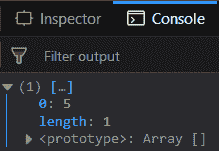
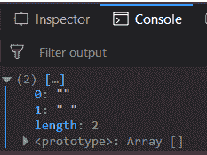
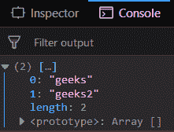
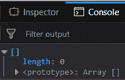

# 下划线. js _。区别()功能

> 原文:[https://www . geesforgeks . org/下划线-js-_-差异-函数/](https://www.geeksforgeeks.org/underscore-js-_-difference-function/)

下划线. js 是一个 JavaScript 库，它提供了很多有用的功能，比如映射、过滤、调用等，甚至不使用任何内置对象。
The _。函数的作用是:返回其他数组中没有的数组值。如果数组中存在元素，则该元素将不包含在结果数组中。这是因为第二个数组和第一个数组不同。

**语法:**

```
_.difference( array, *others )
```

**参数:**该函数接受两个参数，如上所述，如下所述:

*   **数组:**此参数用于保存数组元素。
*   **其他:**是需要删除元素的数组。

**返回值:**该函数返回一个数组，该数组包含第一个数组中不在第二个数组中的元素。

**将数字列表传递给 _。差()函数:**该。函数的作用是:一个接一个地从列表中获取元素，并检查该元素是否出现在第二个数组中。如果它存在，那么它简单地忽略该元素，否则在结果数组中添加元素。

**示例:**

```
<!DOCTYPE html>
<html>
    <head>
        <script src = 
"https://cdnjs.cloudflare.com/ajax/libs/underscore.js/1.9.1/underscore-min.js" >
        </script>
    </head>
    <body>
        <script type="text/javascript">
            console.log(_.difference([1, 2, 3, 4, 5], 
                                     [1, 2, 3, 4, 6, 7]));
        </script>
    </body>
</html>                    
```

**输出:**


**将错误值传递给 _。difference()函数:**传递假值，如 null、undefined、false，“”(空字符串)，然后传递 _。difference()函数将以同样的方式工作。如果第一个数组中有任何错误值，但第二个数组中没有，那么它将包含在结果数组中。

**示例:**

```
<!DOCTYPE html>
<html>
    <head>
        <script src = 
"https://cdnjs.cloudflare.com/ajax/libs/underscore.js/1.9.1/underscore-min.js" >
        </script>
    </head>
    <body>
        <script type="text/javascript">
            console.log(_.difference([undefined, '', " ", null], 
                                     [undefined, 4, null]));
        </script>
    </body>
</html>                    
```

**输出:**


**将一组字符串传递给 _。difference()函数:**传递包含单词“”的字符串集，然后传递 _。difference()函数将以同样的方式工作。如果这些字符串值中的任何一个出现在第一个数组中，但不出现在第二个数组中，那么它将包含在结果数组中。

**示例:**

```
<!DOCTYPE html>
<html>
    <head>
        <script src = 
"https://cdnjs.cloudflare.com/ajax/libs/underscore.js/1.9.1/underscore-min.js" >
        </script>
    </head>
    <body>
        <script type="text/javascript">
            console.log(_.difference(
                ["This", "is", "geeks", "for", "geeks2"], 
                ["This", "for", "is"])
            );
        </script>
    </body>
</html>                    
```

**输出:**


**将两个具有相同元素的数组传递给 _。difference()函数:**传递具有相同元素的第一个和第二个数组，则检查操作期间的所有元素都将被忽略。因此得到的数组将是空的。

**示例:**

```
<!DOCTYPE html>
<html>
    <head>
        <script src = 
"https://cdnjs.cloudflare.com/ajax/libs/underscore.js/1.9.1/underscore-min.js" >
        </script>
    </head>
    <body>
        <script type="text/javascript">
            console.log(_.difference([1, 2, 3, 4], [1, 2, 3, 4]));
        </script>
    </body>
</html>                    
```

**输出:**


**注意:**这些命令在 Google 控制台或 Firefox 中无法工作，因为需要添加这些他们没有添加的附加文件。因此，将给定的链接添加到您的 HTML 文件中，然后运行它们。

```
<script type="text/javascript" src = 
"https://cdnjs.cloudflare.com/ajax/libs/underscore.js/1.9.1/underscore-min.js"> 
</script> 
```