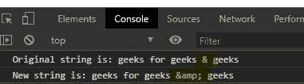
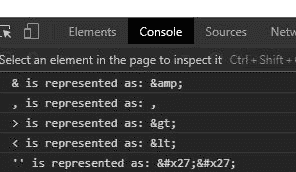

# 下划线. js _。escape()功能

> 原文:[https://www . geesforgeks . org/下划线-js-_-转义-function/](https://www.geeksforgeeks.org/underscore-js-_-escape-function/)

**下划线. js** 是 javascript 中的一个库，使得对数组、字符串、对象的操作变得更加容易和便捷。 **_。escape()** 函数用于转义特殊字符串，防止插入 HTML。获得逃脱的字符串有“ **&** ”、“ **>** ”、“ **<** ”、“**”等。**

****注意:**在浏览器中直接使用该代码时，需要包含一些特价文件。在浏览器中使用下划线功能之前，链接下划线 CDN 是非常必要的。当链接下划线时，“_”作为一个全局变量附加到浏览器中。**

****语法:****

```
_.escape(string);
```

****参数:**只取一个参数，即字符串。**

****返回:**返回字符串。**

**为了更好地理解函数，下面给出了几个例子。**

****例 1:****

```
<!DOCTYPE html> 
<html> 
  <head> 
    <script src =  
"https://cdnjs.cloudflare.com/ajax/libs/underscore.js/1.9.1/underscore-min.js" > 
    </script> 
   </head> 
  <body>
    <script>
      let str="geeks for geeks & geeks";
      let str2=_.escape(str)
      console.log(`Original string is: ${str}`)
      console.log(`New string is: ${str2}`)
    </script>
  </body> 
</html>
```

****输出:****

****

****例 2:****

```
<!DOCTYPE html> 
<html> 
  <head> 
    <script src =  
"https://cdnjs.cloudflare.com/ajax/libs/underscore.js/1.9.1/underscore-min.js" > 
    </script> 
   </head> 
  <body>
    <script>
      console.log(`& is represented as: ${_.escape("&")}`)
      console.log(`, is represented as: ${_.escape(", ")}`)
      console.log(`> is represented as: ${_.escape(">")}`)
      console.log(`< is represented as: ${_.escape("<")}`)
      console.log(`'' is represented as: ${_.escape("''")}`)
    </script>
  </body> 
</html>
```

****输出:****

****