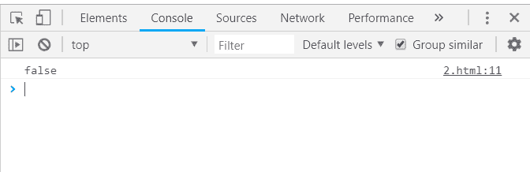
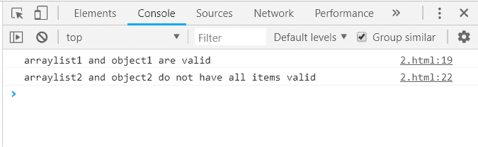

# 下划线. js _。每个功能

> 原文:[https://www . geesforgeks . org/下划线-js-_-every-function/](https://www.geeksforgeeks.org/underscore-js-_-every-function/)

下划线. js 是一个 JavaScript 库，它提供了许多有用的函数，在很大程度上有助于编程，比如映射、过滤、调用等，甚至不使用任何内置对象。
The _。every()函数用于测试列表中的所有元素能否通过给定的测试。如果至少有一个元素没有完成给定的测试，它将停止并返回“false”。当列表中的所有元素都被传递给函数/迭代，并且没有剩余的元素时，那么 _。每个要遍历的函数，如果值 false 还没有作为答案返回，那么返回 true 作为最终答案。将数字、字符、数组、对象等传递给 _。每一个功能。此外，还可以使用 to _。每一个()都像 if 循环一样一起工作。

**语法:**

```
_.every(list, [predicate], [context])
```

**参数:**该功能接受三个参数，如上所述，描述如下:

*   **列表:**此参数用于设置元素列表。
*   **谓词:**此参数用于测试条件。
*   **上下文:**此参数用于显示内容。

**返回值:**返回值为“真”(当列表中的每个元素都满足给定条件时)或“假”(当至少一个元素不满足条件时)

**将数组传递给 _every 函数():**的。_every()函数从列表中逐个取出元素，并对代码执行指定的操作。以下示例包含查找列表中所有有效或无效元素的操作。有效意味着它们不包含 Null、Blanks、false 等。遍历并检查所有元素后，每个函数结束。这里即使单个元素无效，答案也是假的。

**示例:**

```
<html>
    <head>
        <script type="text/javascript" src = 
        "https://cdnjs.cloudflare.com/ajax/libs/underscore.js/1.9.1/underscore-min.js">
        </script>
        <script type="text/javascript" src = 
        "https://cdnjs.cloudflare.com/ajax/libs/underscore.js/1.9.1/underscore.js"></script>
    </head>  
    <body>
        <script type="text/javascript">
              var arrayvalues = [false, true, 'yes', null, 1];
              console.log(_.every(arrayvalues, function (value) {
                  return (value);
              }));
        </script>
    </body> 
</html>
```

**输出:**


**将数字列表传递给 _。every()函数:**传递一个数字列表，并对其进行简单的运算。下面的例子用来判断一个数是否为偶数。如果列表中的所有数字都是偶数，则输出为*真*否则为*假*。

**示例:**

```
<html>  
    <head>
        <script type="text/javascript" src = 
        "https://cdnjs.cloudflare.com/ajax/libs/underscore.js/1.9.1/underscore-min.js">
        </script>
        <script type="text/javascript" src = 
        "https://cdnjs.cloudflare.com/ajax/libs/underscore.js/1.9.1/underscore.js">
        </script>
    </head>      
    <body>
        <script type="text/javascript">
            console.log(_.every([2, 4, 5], function(num) { return num % 2 == 0; }));
        </script>
    </body> 
</html>
```

**输出:** 

**将结构传递给 _。every()函数:**首先声明数组(数组的名字叫人)。选择一个条件检查*是否有长头发*。Console.log 显示最终答案。

**示例:**

```
<html>  
    <head>
        <script type="text/javascript" src = 
        "https://cdnjs.cloudflare.com/ajax/libs/underscore.js/1.9.1/underscore-min.js">
        </script>
        <script type="text/javascript" src = 
        "https://cdnjs.cloudflare.com/ajax/libs/underscore.js/1.9.1/underscore.js">
        </script>
    </head>      
    <body>
        <script type="text/javascript">
            var people = [
                {name: 'sakshi', car: ''},
                {name: 'aishwarya', car: true},
                {name: 'akansha', car: true},
                {name: 'preeti', car: true}
            ],

            hasLongHairs = function (value) {
                return (value.car !== '');
            };

            console.log(_.every(people, hasLongHairs));
        </script>
    </body> 
</html>
```

**输出:** 

**使用两个 _。every()一起作用:**将不同的对象传递给每个 _。every()函数，然后通过使用像 *& &、||、！*等。这里，object1 和 arralist1 包含所有真值，因此两个 true 的结果也将为真。因此，第一个条件得到满足。object2 包含“null”，arraylist2 也包含“null”，因此它们无效。使用“！”每隔 _。函数，所以结果是两个真值。

**示例:**

```
<html>  
    <head>
        <script type="text/javascript" src = 
        "https://cdnjs.cloudflare.com/ajax/libs/underscore.js/1.9.1/underscore-min.js">
        </script>
        <script type="text/javascript" src = 
        "https://cdnjs.cloudflare.com/ajax/libs/underscore.js/1.9.1/underscore.js">
        </script>
    </head>      
    <body>
        <script type="text/javascript">
             var arraylist1 = [true];
             var arraylist2 = [null, {}, undefined, {}];
             var object1 = {prop1: true};
             var object2 = {
                    prop1: null,
                    prop2: true, prop3: true,
             }; 
             if (_.every(arraylist1) && _.every(object1)) {
                    console.log('arraylist1 and object1 are valid');
             }
             if (!_.every(arraylist2) && !_.every(object2)) {
                    console.log('arraylist2 and object2 do not have all items valid');
             }
        </script>
    </body> 
</html>
```

**输出:** 