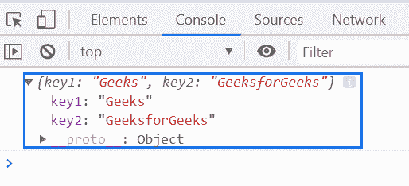
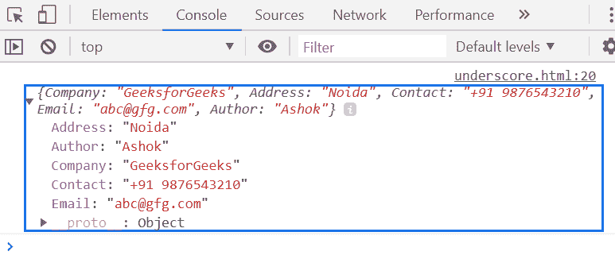

# 下划线. js _。扩展()功能

> 原文:[https://www . geesforgeks . org/下划线-js-_-extend-function/](https://www.geeksforgeeks.org/underscore-js-_-extend-function/)

**_。extend()函数**用于在目标对象上创建源对象所有属性的副本，并返回目标对象。嵌套数组或对象将通过引用来复制，而不是复制。

**语法:**

```
_.extend(destination, *sources)
```

**参数:**该函数接受两个参数，如上所述，如下所述:

*   **目标:**此参数保存目标对象文件。
*   **来源:**此参数保存源对象文件。

**返回值:**返回目标对象上源对象所有属性的副本，并返回目标对象。

**例 1:**

```
<!DOCTYPE html>
<html>

<head>
    <script type="text/javascript" src=
"https://cdnjs.cloudflare.com/ajax/libs/underscore.js/1.9.1/underscore-min.js">
    </script>
</head>

<body>
    <script type="text/javascript">

        var obj1 = {
            key1: 'Geeks',
        };

        var obj2 = {
            key2: 'GeeksforGeeks',
        };

        console.log(_.extend(obj1, obj2));
    </script>
</body>

</html>
```

**输出:**


**例 2:**

```
<!DOCTYPE html>
<html>

<head>
    <script type="text/javascript" src=
"https://cdnjs.cloudflare.com/ajax/libs/underscore.js/1.9.1/underscore-min.js">
    </script>
</head>

<body>
    <script type="text/javascript">

        var obj1 = {
            key1: 'Geeks',
        };

        var obj2 = {
            key2: 'GeeksforGeeks',
        };

        console.log(_.extend({
            Company: 'GeeksforGeeks',
            Address: 'Noida'
        }, {
            Contact: '+91 9876543210',
            Email: 'abc@gfg.com'
        }, {
            Author: 'Ashok'
        }));
    </script>
</body>

</html>
```

**输出:**
