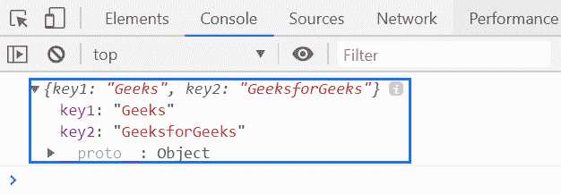
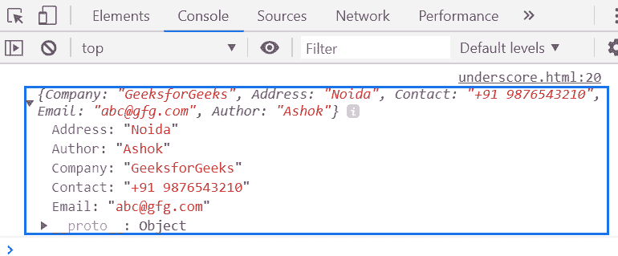

# 下划线. js _。extendOwn()功能

> 原文:[https://www . geesforgeks . org/下划线-js-_-extendown-function/](https://www.geeksforgeeks.org/underscore-js-_-extendown-function/)

**_。extendOwn()函数**用于仅将自己的属性复制到目标对象上。这个函数类似于 _。extend()函数。

**语法:**

```
_.extendOwn(destination, *sources)
```

**参数:**该函数接受两个参数，如上所述，如下所述:

*   **目标:**此参数保存目标对象文件。
*   **来源:**此参数保存源对象文件。

**返回值:**它将自身属性的副本返回给目标对象。

**例 1:**

```
<!DOCTYPE html>
<html>

<head>
    <script type="text/javascript" src=
"https://cdnjs.cloudflare.com/ajax/libs/underscore.js/1.9.1/underscore-min.js">
    </script>
</head>

<body>
    <script type="text/javascript">

        var obj1 = {
            key1: 'Geeks',
        };

        var obj2 = {
            key2: 'GeeksforGeeks',
        };

        console.log(_.extendOwn(obj1, obj2));
    </script>
</body>

</html>
```

**输出:**


**例 2:**

```
<!DOCTYPE html>
<html>

<head>
    <script type="text/javascript" src=
"https://cdnjs.cloudflare.com/ajax/libs/underscore.js/1.9.1/underscore-min.js">
    </script>
</head>

<body>
    <script type="text/javascript">

        var obj1 = {
            key1: 'Geeks',
        };

        var obj2 = {
            key2: 'GeeksforGeeks',
        };

        console.log(_.extendOwn({
            Company: 'GeeksforGeeks',
            Address: 'Noida'
        }, {
            Contact: '+91 9876543210',
            Email: 'abc@gfg.com'
        }, {
            Author: 'Ashok'
        }));
    </script>
</body>

</html>
```

**输出:**
