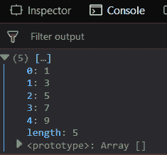
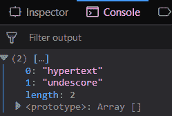
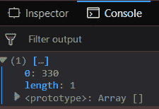
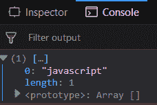

# 下划线. js _。过滤功能

> 原文:[https://www . geesforgeks . org/下划线-js-_-过滤器-函数/](https://www.geeksforgeeks.org/underscore-js-_-filter-function/)

下划线. js 是一个 JavaScript 库，它提供了许多有用的功能，如映射、过滤、调用等，甚至不使用任何内置对象。

**_。filter()** 用于检查传递的数组中哪些元素满足条件。它将形成一个新的数组，包含所有满足从数组传递的条件的元素。当需要从一个大数组中找到某些元素时，通常使用它。

**语法:**

```
_.filter( list, predicate, [context] )
```

**参数:**该函数接受三个参数，如上所述，如下所述:

*   **列表:**此参数用于保存项目列表。
*   **谓词:**此参数用于保存真值条件。
*   **上下文:**需要显示的文本内容。它是可选参数。

**返回值:**返回由满足条件的元素组成的数组。

**将数字列表传递给 _。filter()函数:** The _。filter()函数从列表中逐个获取元素，并检查代码上的指定操作。像这里的操作是找到列表的元素是偶数还是不是。只有奇数元素将被添加到结果数组中。

**示例:**

```
<!DOCTYPE html>
<html>
    <head>
        <script type="text/javascript" src=
"https://cdnjs.cloudflare.com/ajax/libs/underscore.js/1.9.1/underscore-min.js" >
        </script>
    </head>
    <body>
        <script type="text/javascript">
            var oddNo = _.filter([1, 2, 3, 4, 5, 6, 7, 8, 9, 10], 
                function(num){ 
                    return num % 2 != 0;
                });
            console.log(oddNo);
        </script>
    </body>
</html>                    
```

**输出:** 

**将单词列表传递给 _。filter()函数:** The _。filter()函数从列表中一个接一个地获取元素单词，并检查代码上的指定操作。像这里一样，操作是找到列表中长度为 9 的元素。只有那些单词将被添加到长度等于 9 的结果数组中。

**示例:**

```
<!DOCTYPE html>
<html>
    <head>
        <script type="text/javascript" src=
        "https://cdnjs.cloudflare.com/ajax/libs/underscore.js/1.9.1/underscore-min.js" >
        </script>
    </head>
    <body>
        <script type="text/javascript">
            var words = ['javascript', 'java', 'unix', 'hypertext', 'undescore', 'CSS'];
            const result = words.filter(word => word.length == 9);
            console.log(result);
        </script>
    </body>
</html>                    
```

**输出:**


**将单独的函数传递给 _。filter():** 将用户定义的函数传递给 _。filter()函数。首先，像这里一样声明函数，函数名是“maximum()”，如果它大于或等于 100，则返回元素。这个函数可以做用户声明的任何比较。然后，在 _。过滤器通过此功能。在 console.log 结尾)生成的数组。

**示例:**

```
<!DOCTYPE html>
<html>
    <head>
        <script type="text/javascript" src= 
        "https://cdnjs.cloudflare.com/ajax/libs/underscore.js/1.9.1/underscore-min.js" >
        </script>
    </head> 
    <body>
        <script type="text/javascript">
            function largest(v) {
                return v >= 100;
            }
            var res = [1, 4, 12, 15, 8, 330, 54].filter(largest);
            console.log(res);
        </script>
    </body> 
</html>                    
```

**输出:**


**使用其他函数。filter()函数:**在 _ 中使用 toLowerCase()和 indexOf()函数。filter()函数。首先找到每个元素的索引，然后检查它是否大于-1。由于在末尾使用了 console.log()，因此输出将只出现在传递的数组的最后一个元素中。

**示例:**

```
<!DOCTYPE html>
<html> 
    <head>
        <script type="text/javascript" src=
        "https://cdnjs.cloudflare.com/ajax/libs/underscore.js/1.9.1/underscore-min.js" >
        </script>
    </head> 
    <body>
        <script type="text/javascript">
            const lang = ['hypertext', 'markup', 'language', 'cascading',
                                        'style', 'sheet', 'javascript'];
            const func = (query) => 
            {
                return lang.filter((el) =>
                    el.toLowerCase().indexOf(query.toLowerCase()) > -1
                );
            }
            console.log(func('pt')); 
        </script>
    </body> 
</html>                    
```

**输出:**


**注意:**这些命令在 Google 控制台或 Firefox 中无法工作，因为需要添加这些他们没有添加的附加文件。因此，将给定的链接添加到您的 HTML 文件中，然后运行它们。

```
<script type="text/javascript" src = 
"https://cdnjs.cloudflare.com/ajax/libs/underscore.js/1.9.1/underscore-min.js"> 
</script> 
```