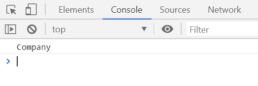
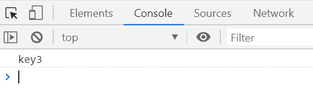

# 下划线. js _。findKey()功能

> 原文:[https://www . geesforgeks . org/下划线-js-_-findkey-function/](https://www.geeksforgeeks.org/underscore-js-_-findkey-function/)

**_。findKey()函数**用于返回谓词逻辑或条件返回真值或未定义的键值。谓词函数/条件通过迭代进行转换，以便于简化语法。

**语法:**

```
_.findKey(object, predicate, [context])
```

**参数:**该函数接受三个参数，如上所述，如下所述:

*   **列表:**此参数用于保存项目列表。
*   **谓词:**此参数用于保存真值条件。
*   **上下文:**需要显示的文本内容。它是可选参数。

**返回值:**返回谓词逻辑或条件返回真或未定义的键值。

**例 1:**

```
<!DOCTYPE html>
<html>

<head>
    <script type="text/javascript" src=
"https://cdnjs.cloudflare.com/ajax/libs/underscore.js/1.9.1/underscore-min.js">
    </script>
</head>

<body>
    <script type="text/javascript">

        var info = {
            Company: 'GeeksforGeeks',
            Address: 'Noida',
            Contact: '+91 9876543210'
        };

        var key = _.findKey(info, function (value) {
            return value === 'GeeksforGeeks';
        });

        console.log(key);
    </script>
</body>

</html>
```

**输出:**


**例 2:**

```
<!DOCTYPE html>
<html>

<head>
    <script type="text/javascript" src=
"https://cdnjs.cloudflare.com/ajax/libs/underscore.js/1.9.1/underscore-min.js">
    </script>
</head>

<body>
    <script type="text/javascript">

        var info = {
            key1: 'Geeks',
            key2: 'GFG',
            key3: 'GeeksforGeeks',
            key4: 'Hello',
            key5: 'Welcome'
        };

        var key = _.findKey(info, function (value) {
            return value.length == 13;
        });

        console.log(key);
    </script>
</body>

</html>
```

**输出:**
