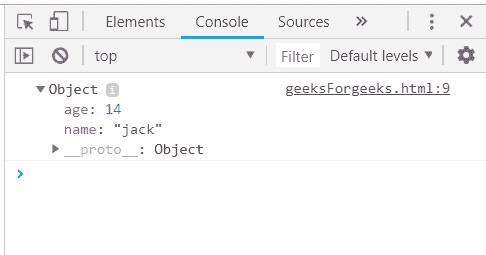
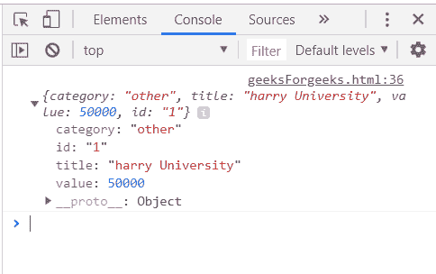
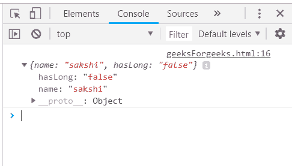
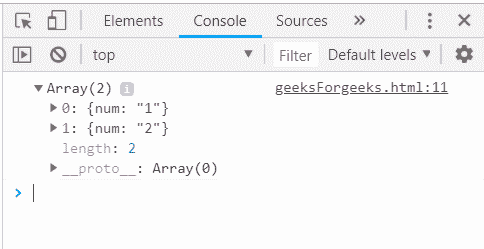

# 下划线. js _。第一()功能

> 原文:[https://www . geesforgeks . org/下划线-js-_-first-function/](https://www.geeksforgeeks.org/underscore-js-_-first-function/)

下划线. js 是一个 JavaScript 库，它提供了许多有用的函数，这些函数在很大程度上有助于编程，比如映射、过滤、调用等，甚至不使用任何内置对象。
The _。first()函数用于返回数组的第一个元素，即第零个索引处的数字。它通过在数组中传递变量 n，返回 m 大小(n < m)的数组中的前 n 个元素。它是下划线. js 库的一个非常容易使用的函数，在处理数组元素时被广泛使用。

**语法:**

```
_.first(array, [n]) 
```

**参数:**该函数接受两个参数，如上所述，如下所述:

*   **数组:**此参数用于保存元素的数组。
*   **变量:**它告诉你想要的元素数量。

**返回值:**该函数返回元素数组。

**将数组传递给 _。第一个函数():**的。_first()函数将返回第一个元素以及传递的数组的所有属性。像这里一样，元素有两个属性，名称和年龄，所以最终结果将包含第一个元素的这两个属性，因为变量 n 没有在这里传递。

**示例:**

```
<html>
    <head>
        <script type="text/javascript" src=
"https://cdnjs.cloudflare.com/ajax/libs/underscore.js/1.9.1/underscore.js">
    </script>
    </head>
    <body>
        <script type="text/javascript">
        console.log(_.first([{name: 'jack', age: 14}, 
                             {name: 'jill', age: 15}, 
                             {name: 'humpty', age: 16}]));
        </script>
    </body>
</html>                    
```

**输出:**


**将结构传递给 _。第一个()函数:** The。_first()函数将返回第一个元素以及传递的数组的所有属性，因为这里没有传递变量 n。像这里一样，每个元素有四个属性，类别、标题、值和 id。因此，最终结果将包含第一个元素的所有这些属性。

**示例:**

```
<html>
    <head>
        <script type="text/javascript" src = 
"https://cdnjs.cloudflare.com/ajax/libs/underscore.js/1.9.1/underscore-min.js" >
        </script>
    </head>
    <body>
        <script type="text/javascript">
            var goal  = [
            {
                "category" : "other",
                "title" : "harry University",
                "value" : 50000,
                "id":"1"
            },
            {
                "category" : "traveling",
                "title" : "tommy University",
                "value" : 50000,
                "id":"2"
            },
            {
                "category" : "education",
                "title" : "jerry University",
                "value" : 50000,
                "id":"3"
            },
            {    
                "category" : "business",
                "title" : "Charlie University",
                "value" : 50000,
                "id":"4"
            }
        ]
        console.log(_.first(goal));
        </script>
    </body>
</html>
```

**输出:**


**将一个属性为真/假的数组传递给 _。first()函数:**这将与上面两个示例完全相同。false/true 属性将只显示在第一个元素中。在这里，逻辑上不会使用该属性。

**示例:**

```
<html>
    <head>
        <script type="text/javascript" src = 
"https://cdnjs.cloudflare.com/ajax/libs/underscore.js/1.9.1/underscore-min.js" >
        </script>
    </head>
    <body>
        <script type="text/javascript">
            var people = [
            {"name": "sakshi", "hasLong": "false"},
            {"name": "aishwarya", "hasLong": "true"},
            {"name": "akansha", "hasLong": "true"},
            {"name": "preeti", "hasLong": "true"}
        ]
         console.log(_.first(people));
        </script>
    </body>
</html>
```

**输出:**


**将变量为 n 的数组传递给 _。first()函数:**要有多个元素是第一个元素，只需传递数字并得到一个结果。请记住，元素总是来自数组的开始。

**示例:**

```
<html>
    <head>
        <script type="text/javascript" src = 
"https://cdnjs.cloudflare.com/ajax/libs/underscore.js/1.9.1/underscore-min.js" >
        </script>
    </head>
    <body>
        <script type="text/javascript">
             var users = [{"num":"1"}, {"num":"2"}, 
             {"num":"3"}, {"num":"4"}, {"num":"5"}];
        console.log(_.first(users, 2));
        </script>
    </body>
</html>
```

**输出:**
