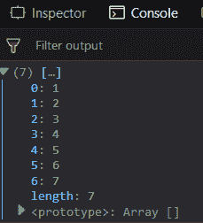
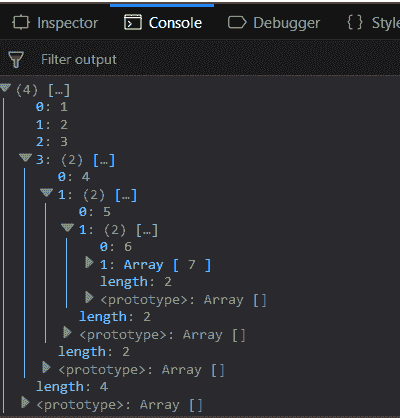
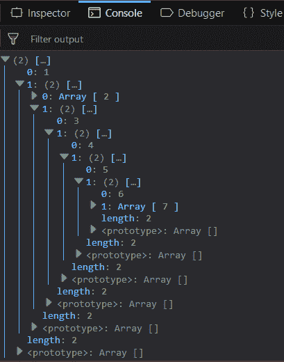
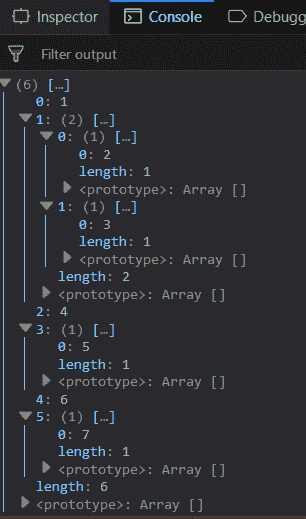

# 下划线. js _。展平()功能

> 原文:[https://www . geesforgeks . org/下划线-js-_-扁平化-函数/](https://www.geeksforgeeks.org/underscore-js-_-flatten-function/)

_。flatten()函数是 JavaScript 的下划线. js 库中的一个内置函数，用于将嵌套到某个级别的数组展平。得到的数组没有深度。它将完全变平。如果通过浅层参数，那么展平将只进行到一个级别。数组的深度由方括号的数量给出。示例:数组[10，[20]]包含 10 个深度为 1 的元素，因为它仅位于单个括号([])内，而元素 20 的深度为 2。

**语法:**

```
_.flatten(array, [shallow])
```

**参数:**该功能包含两个参数，如下所示:

*   **数组:**此参数用于保存数组元素。
*   **浅:**用于将一个数组展平为单级。

**返回值:**返回一级或所有级的展平数组。

**传递一个没有浅层参数的列表 _。扁平化()功能:** The _。flatten()函数用于使嵌套数组变平。它会将数组移除所有深度，使其处于 1 级。因为没有给出第二个参数，所以它的深度会减少。

**示例:**

```
<!DOCTYPE html>
<html>
    <head>
        <script src = 
"https://cdnjs.cloudflare.com/ajax/libs/underscore.js/1.9.1/underscore-min.js" >
        </script>
    </head>
    <body>
        <script type="text/javascript">
            console.log(_.flatten([1, [2], [3, [4, [5, [6, [7]]]]]]));
        </script>
    </body>
</html>                    
```

**输出:**


**将第二个参数传递给 _。扁平化()函数:**将第二个参数传递给函数，使 n 深度数组扁平化为 n-1 深度。在下面的示例中，元素 1、2 和 3 仅包含在一个括号内，因此它们没有深度。元素 4 在给定的数组中有 2 个深度，所以它现在只有 1 个深度，因此用 1、2 和 3 个元素看不到它。5 元素有 3 个深度，因此在结果数组中将有 2 个深度。同样，第 6 个元素的深度是 6。最后一个元素 7 有 5 个深度，所以它将显示在最内部的数组中。

**示例:**

```
<!DOCTYPE html>
<html>
    <head>
        <script src = 
"https://cdnjs.cloudflare.com/ajax/libs/underscore.js/1.9.1/underscore-min.js" >
        </script>
    </head>
    <body>
        <script type="text/javascript">
            console.log(_.flatten([1, [2], [3, [4, [5, [6, [7]]]]]], true));
        </script>
    </body>
</html>                    
```

**输出:** 

**使用浅层参数的另一个示例:**在此示例中，元素 1 的深度为 1，因此它将与 2 个元素的数组一起显示在起始级别。1 <sup>st</sup> 元素包含 2 个元素，其中作为第二个元素也有 2 个元素。第一个元素是 3，第二个元素也是 2。同样，该数组也有 4 个元素和一个元素数组。继续这样下去，那么最后的数组将包含元素 7。

**示例:**

```
<html>

<head>
    <script src = 
"https://cdnjs.cloudflare.com/ajax/libs/underscore.js/1.9.1/underscore-min.js" >
    </script>
</head>

<body>
    <script type="text/javascript">
        console.log(_.flatten([1, [[[2], [3, [4, [5, [6, [7]]]]]]]], true));
    </script>
</body>

</html>
```

**输出:** 

**另一个例子是 _。具有浅层参数的 flat()函数:**在此示例中，元素 1、4、6 可以在第一层看到，因为它们的深度为 1。除此之外，第一层包含 2 个元素的数组和 2 个各 1 个元素的数组。大小为 2 的数组包含下一级的元素 2 和 3。一个大小的数组包含 5 个，另一个包含 7 个，因为它们的原始深度是 2。

**示例:**

```
<!DOCTYPE html>
<html>
    <head>
        <script src = 
"https://cdnjs.cloudflare.com/ajax/libs/underscore.js/1.9.1/underscore-min.js" >
        </script>
    </head>
    <body>
        <script type="text/javascript">
            console.log(_.flatten([1, [[[2], [3]]], [4, [5]], [6, [7]]], true));
        </script>
    </body>
</html>                    
```

**输出:** 