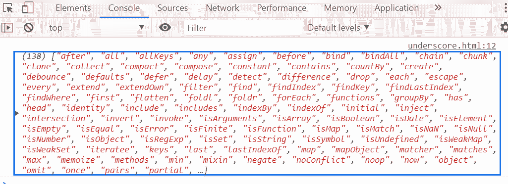

# 下划线. js _。功能()功能

> 原文:[https://www . geesforgeks . org/下划线-js-_-functions-function/](https://www.geeksforgeeks.org/underscore-js-_-functions-function/)

_。functions()函数用于返回对象中存在的所有方法的排序列表。

**语法:**

```
_.functions(object)
```

**参数:**该功能接受如上所述的单个参数，描述如下:

*   **对象:**它包含保存元素[键，值]对的对象元素。

**返回值:**返回对象中存在的所有方法的排序列表。

**示例:**

```
<!DOCTYPE html>
<html>

<head>
    <script type="text/javascript" src=
"https://cdnjs.cloudflare.com/ajax/libs/underscore.js/1.9.1/underscore-min.js">
    </script>
</head>

<body>
    <script type="text/javascript">

        console.log(_.functions(_));
    </script>
</body>

</html>
```

**输出:**
