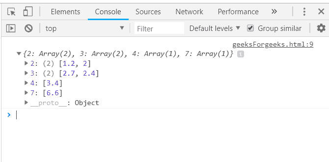
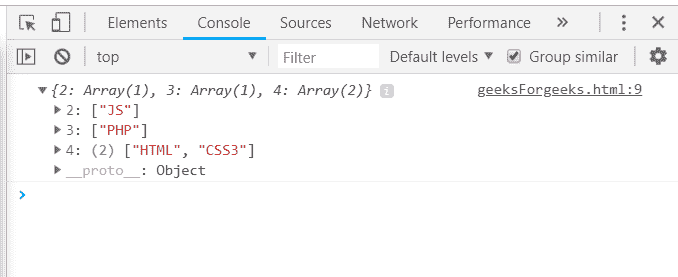
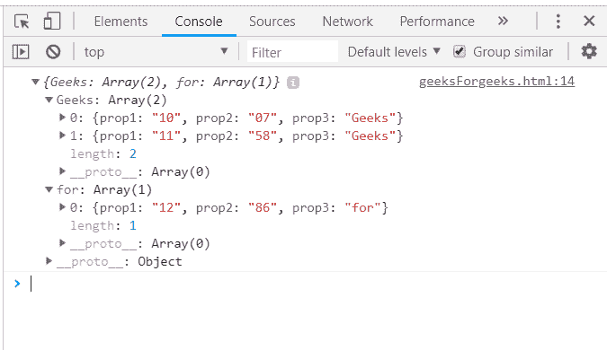
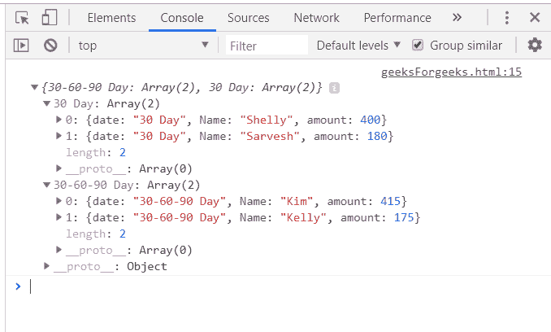

# 下划线. js _。分组功能

> 原文:[https://www . geesforgeks . org/下划线-js-_-groupby-function/](https://www.geeksforgeeks.org/underscore-js-_-groupby-function/)

下划线. js 是一个 JavaScript 库，它提供了许多有用的函数，在很大程度上有助于编程，比如映射、过滤、调用等，甚至不使用任何内置对象。
*_。groupBy()* 函数用于使数组中的元素集合被传递。它通过匹配每个元素的值来工作。如果它们匹配，那么它们被放在一个集合中，否则我们将有 2 个集合/组。我们还可以传递一个函数，基于谁的结果我们将收集元素。它既可以根据数字分组，也可以根据字符串分组。

**语法:**

```
_.groupBy( list, iteratee, context ) 
```

**参数:**该功能接受三个参数，如上所述，描述如下:

*   **列表:**此参数包含元素列表。
*   **迭代:**该参数包含用于文本元素的条件。
*   **上下文:**是用来显示的文本。它是可选参数。

**返回值:**它将集合作为不同的数组返回。

**在 _。groupBy()函数:** The _。函数的作用是:将列表中的元素一个接一个地取出，传递给 Math.ceil()函数。然后，函数的每个元素输出将与 Math.ceil()中另一个元素的输出相匹配，然后将它们放在 1 个组中，否则它们将放在 2 个单独的组中。在所有元素都与其余所有元素匹配之后。groupBy 函数结束。

**示例:**

```
<html>
    <head>
        <script type="text/javascript" src=
        "https://cdnjs.cloudflare.com/ajax/libs/underscore.js/1.9.1/underscore.js">
        </script>
    </head>

    <body>
        <script type="text/javascript">
            console.log(_.groupBy([2.7, 3.4, 6.6, 1.2, 2.0, 2.4], function(num) {
                return Math.ceil(num); 
            }));
        </script>
    </body>
</html>                    
```

**输出:**


**使用 _ 中的长度()。groupBy()函数:**将数组元素传递给 groupBy()函数，并根据元素的长度进行匹配。如果两个元素的长度相同，那么它们将被分组为 1 组，否则将形成 2 组。

**示例:**

```
<html>
    <head>
        <script type="text/javascript" src=
        "https://cdnjs.cloudflare.com/ajax/libs/underscore.js/1.9.1/underscore.js">
        </script>
    </head>
    <body>
        <script type="text/javascript">
           console.log(_.groupBy(['HTML', 'CSS3', 'JS', 'PHP'], 'length'));
        </script>
    </body>
</html>
```

**输出:**


**使用在 _ 中传递的数组的属性。groupBy()函数:**首先声明数组(这里数组是‘arr’)。选择一个需要检查的条件，如这里的“prop3”。那么在“prop3”中具有相同值的元素将被分组为一组。记录最终答案。

**示例:**

```
<html>
    <head>
        <script type="text/javascript" src=
        "https://cdnjs.cloudflare.com/ajax/libs/underscore.js/1.9.1/underscore.js">
        </script>
    </head>
    <body>
        <script type="text/javascript">
            var arr =  [
                    {prop1:"10", prop2:"07", prop3: "Geeks"},
                    {prop1:"12", prop2:"86", prop3: "for"},
                    {prop1:"11", prop2:"58", prop3: "Geeks"} 
                ];
               console.log(_.groupBy(arr, 'prop3'));
        </script>
    </body>
</html>
```

**输出:**


**将“日期”作为数组的属性传递给 _。groupBy()函数的作用是:**首先定义一个数组，其中一个属性为“日期”，格式为“dd-mm-yy”。然后将数组和' date '属性传递给 _。groupBy()函数。具有相同日期的元素将被分组为一组。组编号将从 0 开始。

**示例:**

```
<html>
    <head>
        <script type="text/javascript" src=
        "https://cdnjs.cloudflare.com/ajax/libs/underscore.js/1.9.1/underscore.js">
        </script>
    </head>
    <body>
        <script type="text/javascript">
               var orders = [
                           {    date:"30-60-90 Day", Name:"Kim", amount:415     },
                    {   date:"30-60-90 Day", Name:"Kelly", amount:175     },
                    {   date:"30 Day", Name:"Shelly", amount:400     },
                    {   date:"30 Day", Name:"Sarvesh", amount:180     }
                    ];
                console.log(_.groupBy(orders, "date"));
        </script>
    </body>
</html>
```

**输出:**
