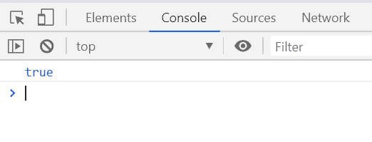
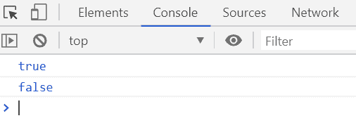

# 下划线. js | _。具有()功能

> 原文:[https://www.geeksforgeeks.org/underscore-js-_-has-function/](https://www.geeksforgeeks.org/underscore-js-_-has-function/)

**_。has()函数**用于检查给定对象是否包含给定键。

**语法:**

```
_.has(object, key)
```

**参数:**该函数接受两个参数，如上所述，如下所述:

*   **对象:**包含对象元素。
*   **键:**包含给定对象中需要检查的键。

**返回值:**如果键存在于对象中，则返回布尔值“真”，否则返回“假”。

下面的例子说明了 **_。在下划线中有()函数**:

**例 1:**

## 超文本标记语言

```
<!DOCTYPE html>
<html>

<head>
    <script type="text/javascript" src=
"https://cdnjs.cloudflare.com/ajax/libs/underscore.js/1.9.1/underscore-min.js">
    </script>
</head>

<body>
    <script type="text/javascript">

        var hasFn = _.has({
            Name: 'Ashok',
            Age: 32,
            Email: 'ashok@gfg.com'
        }, 'Age');

        console.log(hasFn);
    </script>
</body>

</html>
```

**输出:**



**例 2:**

## 超文本标记语言

```
<!DOCTYPE html>
<html>

<head>
    <script type="text/javascript" src=
"https://cdnjs.cloudflare.com/ajax/libs/underscore.js/1.9.1/underscore-min.js">
    </script>
</head>

<body>
    <script type="text/javascript">

        var info = {
            Company: 'GeeksforGeeks',
            Address: 'Noida',
            Contact: '+91 9876543210'
        };

        console.log(_.has(info, 'Company'));
        console.log(_.has(info, 'Cont'));
    </script>
</body>

</html>
```

**输出:**

