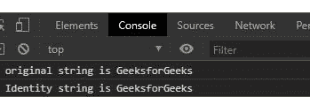
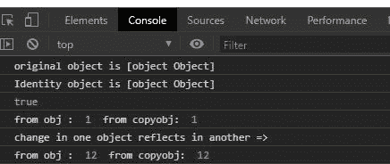

# 下划线. js _。身份()功能

> 原文:[https://www . geesforgeks . org/下划线-js-_-标识-函数/](https://www.geeksforgeeks.org/underscore-js-_-identity-function/)

**下划线. js** 是一个 JavaScript 库，使得对数组、字符串、对象的操作变得更加容易和便捷。
国 **_。identity()** 函数用于返回与参数值完全相同的副本。这个函数看起来没用，但是在整个下划线中作为默认迭代使用。

**注意:**在浏览器中使用下划线功能之前，非常有必要链接不需要的 CDN。链接下划线时，“_”作为全局变量附加到浏览器。

**语法:**

```
_.identity( object );
```

**参数:**此功能接受单参数对象。

**返回值:**该函数返回给定参数的值。

**例 1:**

```
<!DOCTYPE html>
<html>

<head>
    <script src=
"https://cdnjs.cloudflare.com/ajax/libs/underscore.js/1.9.1/underscore-min.js">
    </script>
</head>

<body>
    <script>

        // Creating a string
        let str = new String("GeeksforGeeks")

        // _.identity function of underscore.js
        let copystr = _.identity(str)
        console.log(`original string is ${str}`)
        console.log(`Identity string is ${copystr}`)
    </script>
</body>

</html>
```

**输出:**



**例 2:**

```
<!DOCTYPE html>
<html>

<head>
    <script src=
"https://cdnjs.cloudflare.com/ajax/libs/underscore.js/1.9.1/underscore-min.js">
    </script>
</head>

<body>
    <script>

        // Creating a object
        let obj = {
            "a": 1,
            "b": 2,
            "c": 3
        }

        // _.identity function of underscore.js
        let copyobj = _.identity(obj)
        console.log(`original object is ${obj}`)
        console.log(`Identity object is ${copyobj}`)

        // This will return true
        console.log(obj === copyobj)

        // Both objects are exactly same
        console.log("from obj : ", obj.a, 
            " from copyobj: ", copyobj.a);

        // Made Changes in object
        obj.a = 12

        // Change in one object 
        // reflects in another
        console.log("change in one object"
            + " reflects in another =>")
        console.log("from obj : ", obj.a, 
            " from copyobj: ", copyobj.a);
    </script>
</body>

</html>
```

**输出:**

