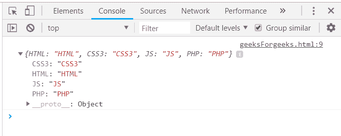
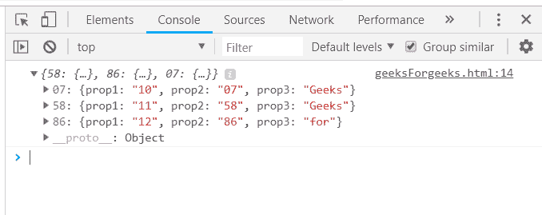
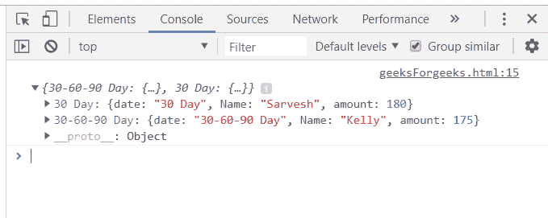
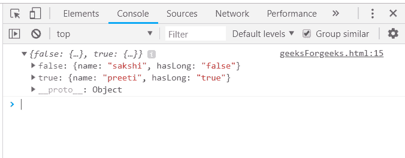

# 下划线. js _。索引功能

> 原文:[https://www . geesforgeks . org/下划线-js-_-indexby-function/](https://www.geeksforgeeks.org/underscore-js-_-indexby-function/)

下划线. js 是一个 JavaScript 库，它提供了许多有用的函数，在很大程度上有助于编程，比如映射、过滤、调用等，甚至不使用任何内置对象。
*_。indexBy()* 函数用于为列表中的每个元素返回一个键，然后返回一个包含每个项目索引的对象。它根据参数中的给定属性给出结果。此外，它类似于 groupBy()函数，但是每个项目在开始都有一个索引。传递的数组必须具有唯一的属性(需要作为参数传递的属性)。如果属性不是唯一的，那么输出将是最后一个匹配的元素。

**参数:**该功能接受三个参数，如上所述，描述如下:

*   **列表:**该参数包含项目列表。
*   **迭代:**该参数用于保持测试条件。
*   **上下文:**此参数用于显示内容。

**返回值:**返回值是元素及其索引(参数中传递的属性)。
**直接传阵到 _。indexBy()函数:** The _。indexBy()函数从列表中一个接一个地获取元素，并在结果中显示它和它们的索引。遍历并显示所有元素和索引后，排序依据函数结束。然后通过执行 console.log()来显示元素。

**示例:**

## 超文本标记语言

```
<html>
    <head>
        <script type="text/javascript" src=
        "https://cdnjs.cloudflare.com/ajax/libs/underscore.js/1.9.1/underscore.js">
        </script>
    </head>
    <body>
        <script type="text/javascript">
            console.log(_.indexBy(['HTML', 'CSS3', 'JS', 'PHP']));
        </script>
    </body>
</html>                    
```

**输出:**



**将多于 1 个属性的数组传递给 _。indexBy()函数:**将一个有多个属性的数组(像这里的 3 个属性)传递给 indexBy()函数，只显示元素 1 乘 1 以及它们的索引。索引将根据参数中给出的属性进行选择，这里的属性是“prop2”。因此，在结果中将给出“prop2”的值作为索引。

**示例:**

## 超文本标记语言

```
<html>
    <head>
        <script type="text/javascript" src=
        "https://cdnjs.cloudflare.com/ajax/libs/underscore.js/1.9.1/underscore.js">
        </script>
    </head>
    <body>
        <script type="text/javascript">
           var arr =  [
                {prop1:"10", prop2:"07", prop3: "Geeks"},
                {prop1:"12", prop2:"86", prop3: "for"},
                {prop1:"11", prop2:"58", prop3: "Geeks."} 
            ];
            console.log(_.indexBy(arr, 'prop2'));
        </script>
    </body>
</html>
```

**输出:**



**将具有“日期”属性的结构传递给 _。indexBy()函数:**首先声明数组(这里数组是‘orders’)。该数组包含一个属性作为“date ”,其日期格式为:“dd-mm-yy”。然后将数组和结构传递给 _。indexBy()函数。记录最终答案。

**示例:**

## 超文本标记语言

```
<html>
    <head>
        <script type="text/javascript" src=
        "https://cdnjs.cloudflare.com/ajax/libs/underscore.js/1.9.1/underscore.js">
        </script>
    </head>
    <body>
        <script type="text/javascript">
           var orders = [
                       {   date:"30-60-90 Day", Name:"Kim", amount:415     },
                {   date:"30-60-90 Day", Name:"Kelly", amount:175     },
                {   date:"30 Day", Name:"Shelly", amount:400         },
                {   date:"30 Day", Name:"Sarvesh", amount:180     }
            ];
        console.log(_.indexBy(orders, 'date'));
        </script>
    </body>
</html>
```

**输出:**



**将带有“true”/“false”的数组作为属性传递给 _。indexBy()函数:**声明一个数组(这里像“人”)，其中一个属性为“真”/“假”。这是定义索引的属性，也就是说，现在，索引要么为真，要么为假。也不是因为这个属性有重复，因为有两个值:真，假，但有四个人。因此，只有最后一个具有 false (/true)的元素才会显示在结果中。

**示例:**

## 超文本标记语言

```
<html>
    <head>
        <script type="text/javascript" src=
        "https://cdnjs.cloudflare.com/ajax/libs/underscore.js/1.9.1/underscore.js">
        </script>
    </head>
    <body>
        <script type="text/javascript">
           var people = [
                {"name": "sakshi", "hasLong": "false"},
                {"name": "aishwarya", "hasLong": "true"},
                {"name": "akansha", "hasLong": "true"},
                {"name": "preeti", "hasLong": "true"}
               ]
            console.log(_.indexBy(people, 'hasLong'));
        </script>
    </body>
</html>
```

**输出:**

