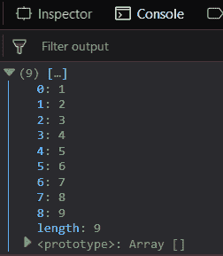
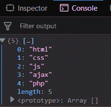
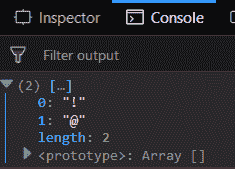
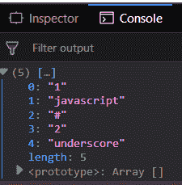

# 下划线. js _。初始()功能

> 原文:[https://www . geesforgeks . org/下划线-js-_-initial-function/](https://www.geeksforgeeks.org/underscore-js-_-initial-function/)

下划线. js 是一个 JavaScript 库，它提供了很多有用的功能，比如映射、过滤、调用等，甚至不使用任何内置对象。
The _。initial()函数用于从数组中排除最后一个元素。此函数用于对除最后一个元素之外的所有元素执行一些操作。这是一个基本函数，有助于区分数组的最后一个元素和所有其他元素。

**语法:**

```
_.initial( array, [n] ) 
```

**参数:**该函数接受两个参数，如下所示:

*   **数组:**此参数用于保存数组元素。
*   **n:** 此参数用于保存最后一个元素 n。

**返回值:**返回除最后一个元素以外的数组。

**将数字列表传递给 _。初始()函数:**的。_initial()函数从列表中逐个取出元素，然后将这个元素添加到结果数组中。它用于打印除最后一个元素之外的所有元素。

**示例:**

```
<!DOCTYPE html>
<html>
    <head>
        <script src =
"https://cdnjs.cloudflare.com/ajax/libs/underscore.js/1.9.1/underscore-min.js" >
        </script>
    </head>
    <body>
        <script type="text/javascript">
            console.log(_.initial([1, 2, 3, 4, 5, 
                            6, 7, 8, 9, 10]));
        </script>
    </body>
</html>                    
```

**输出:**


**传递文字给 _。初始()函数:**的。_initial()函数从列表中一个接一个地获取元素，然后将这个元素添加到结果数组中。结果数组也给出了结果数组的长度。然后 console.log()结果数组。

**示例:**

```
<!DOCTYPE html>
<html>
    <head>
        <script src = 
"https://cdnjs.cloudflare.com/ajax/libs/underscore.js/1.9.1/underscore-min.js" >
        </script>
    </head>
    <body>
        <script type="text/javascript">
            console.log(_.initial(['html', 'css', 'js', 
                            'ajax', 'php', 'node.js']));
        </script>
    </body>
</html>                    
```

**输出:**


**使用 _。initial()函数:**第二个参数用于从数组中选择除第二个参数中给定的元素数量之外的元素并显示它们。第二个参数对于显示除了第二个参数中给出的数字之外的所有元素非常重要。

**示例:**

```
<!DOCTYPE html>
<html>
    <head>
        <script src = 
"https://cdnjs.cloudflare.com/ajax/libs/underscore.js/1.9.1/underscore-min.js" >
        </script>
    </head>
    <body>
        <script type="text/javascript">
            console.log(_.initial(['!', '@', '#', 
                            '{content}apos;, '%', '^']), 4);
        </script>
    </body>
</html>                    
```

**输出:** 

**使用 _。initial()函数:**它从给定数组的第零个索引中获取元素，并显示所有元素。数组元素是单词、字母或数字这一事实并不重要。最后一个元素不包含在列表中。

**示例:**

```
<!DOCTYPE html>
<html>
    <head>
        <script src = 
"https://cdnjs.cloudflare.com/ajax/libs/underscore.js/1.9.1/underscore-min.js" >
        </script>
    </head>
    <body>
        <script type="text/javascript">
            console.log(_.initial(['1', 'javascript', 
                        '#', '2', 'underscore', '^']));
        </script>
    </body>
</html>                    
```

**输出:** 

**注意:**这些命令在 Google 控制台或 Firefox 中无法工作，因为需要添加这些他们没有添加的附加文件。因此，将给定的链接添加到您的 HTML 文件中，然后运行它们。

```
<script type="text/javascript" src = 
"https://cdnjs.cloudflare.com/ajax/libs/underscore.js/1.9.1/underscore-min.js"> 
</script> 
```