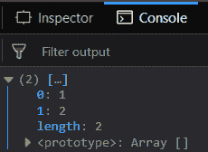
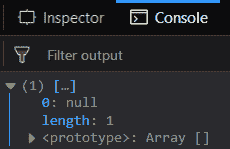
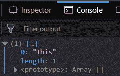
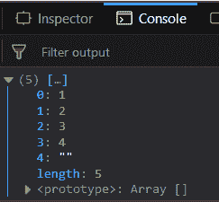

# 下划线. js _。交点()功能

> 原文:[https://www . geesforgeks . org/下划线-js-_-交集-函数/](https://www.geeksforgeeks.org/underscore-js-_-intersection-function/)

下划线. js 是一个 JavaScript 库，它提供了很多有用的功能，比如映射、过滤、调用等，甚至不使用任何内置对象。
The _。交集()函数用于查找传递数组的交集，即 _ 中所有 n 个传递数组共有的元素。交集()函数。这个函数找到所有数组中存在的元素，然后对这些元素进行一些操作，然后使用这个函数。它在最基本的层次上执行交集操作。
**语法:**

```
_.intersection( *arrays )

```

**参数:**该函数接受单参数*数组*，该数组包含一组需要查找公共元素的数组。
**返回值:**返回一个包含所有数组公共元素的数组。
**将数字列表传递给 _。交集()函数:** The。函数的作用是:从列表中逐个取出元素，然后检查它是否在列表中。如果它出现在所有其他数组中，那么只有它将被包含在结果数组中，否则它将被忽略。
**例:**

```
<!DOCTYPE html>
<html>
    <head>
        <script src = 
"https://cdnjs.cloudflare.com/ajax/libs/underscore.js/1.9.1/underscore-min.js" >
        </script>
    </head>
    <body>
        <script type="text/javascript">
            console.log(_.intersection([1, 2, 3, 4, 5], 
                                       [1, 2, 3, 4, 6, 7], 
                                       [1, 2, 6, 8, 9])
            );
        </script>
    </body>
</html>                    
```

**输出:**



**将错误值传递给 _。intersection()函数:**如果传递像 null、undefined 这样的假元素以及像字符串、数字等真元素，那么就传递 _。intersection()函数将以同样的方式工作。尽管是假元素，但常见的元素将出现在结果数组中。
**例:**

```
<!DOCTYPE html>
<html>
    <head>
        <script src = 
"https://cdnjs.cloudflare.com/ajax/libs/underscore.js/1.9.1/underscore-min.js" >
        </script>
    </head>
    <body>
        <script type="text/javascript">
            console.log(_.intersection(["gfg", 52, " ", null], 
                                       [undefined, 4, null], 
                                       ["", null],
                                       ["gfg2", null])
            );
        </script>
    </body>
</html>                    
```

**输出:**



**将单词传递给 _。交集()函数:**如果像字符串一样传递单词，那么 _。intersection()函数将以同样的方式工作。尽管是字符串，但在结果数组中常见的元素是空字符串元素。如下例所示，在所有数组中只有字符串“This”匹配，因此它将被显示。
**例:**

```
<!DOCTYPE html>
<html>
    <head>
        <script src = 
"https://cdnjs.cloudflare.com/ajax/libs/underscore.js/1.9.1/underscore-min.js" >
        </script>
    </head>
    <body>
        <script type="text/javascript">
            console.log(_.intersection(["This", "geeks"], 
                              ['for', "geeks2", "is", "amazing", "This"], 
                              ["This", "is", "best", "platform"])
            );
        </script>
    </body>
</html>                    
```

**输出:**



**将相同的数组元素传递给 _。交集()函数:**传递具有相同元素的数组，那么所有元素都将包含在结果数组中。这是因为所有元素对于所有传递的数组都是公共的。
**例:**

```
<!DOCTYPE html>
<html>
    <head>
        <script src = 
"https://cdnjs.cloudflare.com/ajax/libs/underscore.js/1.9.1/underscore-min.js" >
        </script>
    </head>
    <body>
        <script type="text/javascript">
            console.log(_.intersection([1, 2, 3, 4, ""], 
                                       [1, 2, 3, 4, ""], 
                                       [1, 2, 3, 4, ""])
            );
        </script>
    </body>
</html>                    
```

**输出:**



**注意:**这些命令在 Google 控制台或 Firefox 中无法工作，因为需要添加这些他们没有添加的附加文件。因此，将给定的链接添加到您的 HTML 文件中，然后运行它们。

```
<script type="text/javascript" src = 
"https://cdnjs.cloudflare.com/ajax/libs/underscore.js/1.9.1/underscore-min.js"> 
</script> 
```