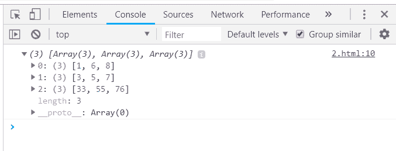
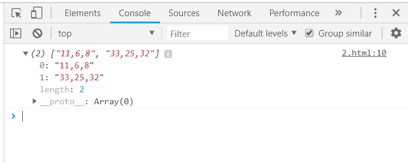
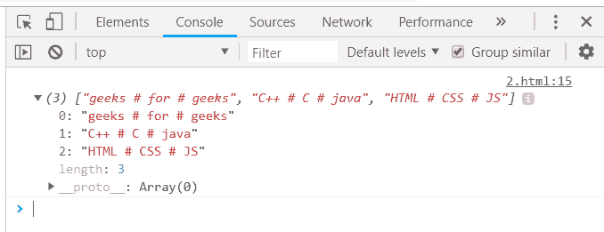

# 下划线. js _。调用函数

> 原文:[https://www . geesforgeks . org/下划线-js-_-调用-function/](https://www.geeksforgeeks.org/underscore-js-_-invokes-function/)

下划线. js 是一个 JavaScript 库，它提供了许多有用的函数，在很大程度上有助于编程，比如映射、过滤、调用等，甚至不使用任何内置对象。

*_。invoke()* 函数用于执行某些操作，如排序、连接、与某个符号连接、使大写字母等成为数组的元素。它通过参数列表中的名称直接调用函数。上述函数将应用于所有数组元素。

**语法:**

```
_.invoke( list, methodName, *arguments ) 

```

**参数:**该功能接受三个参数，如上所述，描述如下:

*   **列表:**此参数用于保存数据列表。
*   **方法名称:**该参数用于保持测试条件。
*   **参数:**这个参数需要在元素之间添加一些符号。

**返回值:**该函数返回给定函数在其上应用后形成的列表。

**将 sort()函数传递给 _。invoke()函数:**的。_invoke()函数从列表中逐个获取元素，并对元素执行指定的功能。sort 函数将按升序对列表进行排序。输出将包含所有排序列表的列表。

**示例:**

## 超文本标记语言

```
<html>
    <head>
        <title>_.invoke() function</title>
        <script type="text/javascript" src=
        "https://cdnjs.cloudflare.com/ajax/libs/underscore.js/1.9.1/underscore-min.js" >
        </script>
        <script type="text/javascript" src=
        "https://cdnjs.cloudflare.com/ajax/libs/underscore.js/1.9.1/underscore.js">
        </script>
    </head>       
    <body>
        <script type="text/javascript">
              console.log(_.invoke([[1, 6, 8], 
                                    [7, 5, 3], 
                                    [33, 76, 55]], 
                                    'sort'));
        </script>
    </body>
</html>
```

**输出:**



**将 join()函数传递给 _。invoke()函数:**将列表与具有“连接”的方法名一起传递。然后列表的元素将被连接在一起。列表中可以传递任意数量的元素。

**示例:**

## 超文本标记语言

```
<html>
    <head>
        <title>_.invoke() function</title>
        <script type="text/javascript" src=
        "https://cdnjs.cloudflare.com/ajax/libs/underscore.js/1.9.1/underscore-min.js" >
        </script>
        <script type="text/javascript" src=
        "https://cdnjs.cloudflare.com/ajax/libs/underscore.js/1.9.1/underscore.js">
        </script>
    </head>       
    <body>
        <script type="text/javascript">
             console.log(_.invoke([[11, 6, 8], [33, 25, 32]], 'join'));
        </script>
    </body>
</html>
```

**输出:**



**将 toUpperCase()函数传递给 _。invoke()函数:**函数*to ppercase()*只适用于字符或字符串，而不适用于数字(原因很明显，数字没有小写或大写)。它需要将字符串数组和*函数传递给 _。调用()函数。字符串将在输出中以大写形式显示。*

**示例:**

## 超文本标记语言

```
<html>
    <head>
        <title>_.invoke() function</title>
        <script type="text/javascript" src=
        "https://cdnjs.cloudflare.com/ajax/libs/underscore.js/1.9.1/underscore-min.js" >
        </script>
        <script type="text/javascript" src=
        "https://cdnjs.cloudflare.com/ajax/libs/underscore.js/1.9.1/underscore.js">
        </script>
    </head>       
    <body>
        <script type="text/javascript">
             console.log(_.invoke(['geeks', 'for', 'geeks'], 'toUpperCase'));
        </script>
    </body>
</html>
```

**输出:**


**用符号连接数组:**用不同的符号、字符等连接数组的元素。使用相同的 Join()函数连接每个元素。在这种情况下，需要给出三个参数，列表名、join()函数名和需要连接的符号/字符。符号将插入到每两个元素之间。

**示例:**

## 超文本标记语言

```
<html>
    <head>
        <title>_.invoke() function</title>
        <script type="text/javascript" src=
        "https://cdnjs.cloudflare.com/ajax/libs/underscore.js/1.9.1/underscore-min.js" >
        </script>
        <script type="text/javascript" src=
        "https://cdnjs.cloudflare.com/ajax/libs/underscore.js/1.9.1/underscore.js">
        </script>
    </head>       
    <body>
        <script type="text/javascript">
             var manyThings = [ 
                    ['geeks', 'for', 'geeks'],
                    ['C++', 'C', 'java'],
                    ['HTML', 'CSS', 'JS'] 
             ];
             console.log(_.invoke(manyThings, 'join', ' # '));
        </script>
    </body>
</html>
```

**输出:**

