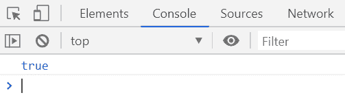
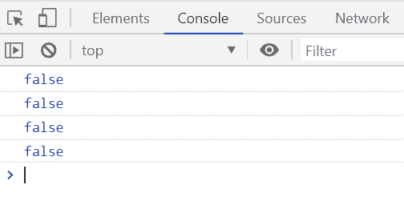

# 下划线. js | _。isArguments()功能

> 原文:[https://www . geesforgeks . org/下划线-js-_-isarguments-function/](https://www.geeksforgeeks.org/underscore-js-_-isarguments-function/)

**_。isArguments()函数**用于检查给定的对象是否是参数。如果给定对象是参数，则返回布尔值“真”，否则返回“假”。

**语法:**

```
_.isArguments( object )
```

**参数:**该函数接受一个参数，如上所述，如下所述:

*   **对象:**该参数保存需要检查是否是参数的对象的值。

**返回值:**如果给定对象是参数，则返回真，否则返回假。

**例 1:**

```
<!DOCTYPE html>
<html>

<head>
    <script type="text/javascript" src=
"https://cdnjs.cloudflare.com/ajax/libs/underscore.js/1.9.1/underscore-min.js">
    </script>
</head>

<body>
    <script type="text/javascript">

        var arg = (function () {
            return _.isArguments(arguments);
        })('Welcome', 'to', 'GeeksforGeeks');

        console.log(arg);
    </script>
</body>

</html>
```

**输出:**


**例 2:**

```
<!DOCTYPE html>
<html>

<head>
    <script type="text/javascript" src=
"https://cdnjs.cloudflare.com/ajax/libs/underscore.js/1.9.1/underscore-min.js">
    </script>
</head>

<body>
    <script type="text/javascript">

        console.log(_.isArguments(true));
        console.log(_.isArguments(1));
        console.log(_.isArguments('GeeksforGeeks'));
        console.log(_.isArguments([1, 2, 3]));
    </script>
</body>

</html>
```

**输出:**
