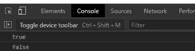
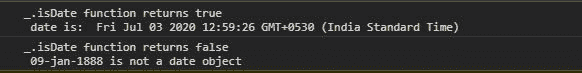

# 下划线. js _。isDate()功能

> 原文:[https://www . geesforgeks . org/下划线-js-_-isdate-function/](https://www.geeksforgeeks.org/underscore-js-_-isdate-function/)

**下划线. js** 是一个 javascript 库，足以轻松高效地处理数组、字符串、对象、映射、集合。 **_。下划线. js 中的 isDate()** 函数用于判断给定的对象是否是日期对象。

**语法:**

```
_.isDate(object);
```

**参数:**只取一个参数，即对象。

**返回:**该函数返回一个布尔值。值为真表示对象是日期对象，否则为假。

**注意:**请在浏览器中通过代码直接使用该代码之前，先链接下划线 CDN。

**例 1:**

```
<!DOCTYPE html> 
<html> 
  <head> 
    <script src =  
"https://cdnjs.cloudflare.com/ajax/libs/underscore.js/1.9.1/underscore-min.js" > 
    </script> 
   </head> 
  <body>
    <script>
      let date=new Date()
      let str="9/9/9";
      console.log(_.isDate(date));
      console.log(_.isDate(str));
    </script>
  </body> 
</html>
```

**输出:**



**例 2:**

```
<!DOCTYPE html> 
<html> 
  <head> 
    <script src =  
"https://cdnjs.cloudflare.com/ajax/libs/underscore.js/1.9.1/underscore-min.js" > 
    </script> 
   </head> 
  <body>
    <script>
      let date1=new Date();
      let date2="09-jan-1888"
      let boolDate1=_.isDate(date1);
      let boolDate2=_.isDate(date2);
      if(boolDate1)
      console.log(
`_.isDate function returns ${boolDate1} \n date is:  ${date1}`)
      else
      console.log(
`_.isDate function returns ${boolDate1} 
\n ${data1} is not a date object`)
      if(boolDate2)
      console.log(
`_.isDate function returns ${boolDate2} \n date is ${date2}`)
      else
      console.log(
`_.isDate function returns ${boolDate2} 
\n ${date2} is not a date object`)
    </script>
  </body> 
</html>
```

**输出:**

