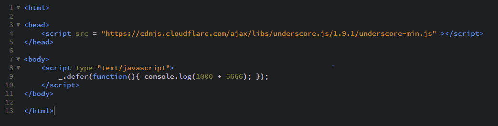

# 下划线. js _。isElement()函数

> 原文:[https://www . geesforgeks . org/下划线-js-_-iselement-function/](https://www.geeksforgeeks.org/underscore-js-_-iselement-function/)

**_。isElement()函数:**用于检查元素是否为文档对象模型。文档对象模型是 javascript 查看包含页面的数据的方式。级联样式表和 javascript 与文档对象模型交互。

**语法:**

```
_.isElement(object)
```

**参数:**
只需要一个参数，就是需要检查的对象元素。

**返回值:**
如果是 DOM 元素则返回 true，否则返回 false。

**示例:**

1.  **Passing html tag to the _.isElement() function:**
    The _.isElement() function takes the element and perform the checking function. It checks whether it is a DOM element or not. Like here, the argument passed to the _.isElement() function is ‘html’ and since we know it is a DOM element so, true is returned in the output.

    ```
    <!-- Write HTML code here -->
    <html>

    <head>
        <script src = 
        "https://cdnjs.cloudflare.com/ajax/libs/underscore.js/1.9.1/underscore-min.js">
         </script>

        <script src=
        "https://ajax.aspnetcdn.com/ajax/jQuery/jquery-3.3.1.min.js">
        </script>
    </head>

    <body>
        <script type="text/javascript">
            console.log(_.isElement(jQuery('html')[0]));
        </script>
    </body>

    </html>
    ```

    **输出:** 

2.  **Passing body tag to the _.isElement() function:**
    In this case, we pass ‘body’ tag as an argument to the _.isElement() function. Since, we know that ‘body’ tag is a DOM element therefore the output will be true.

    ```
    <!-- Write HTML code here -->
    <html>

    <head>
        <script src = 
        "https://cdnjs.cloudflare.com/ajax/libs/underscore.js/1.9.1/underscore-min.js">
        </script>

        <script src=
        "https://ajax.aspnetcdn.com/ajax/jQuery/jquery-3.3.1.min.js">
        </script>
    </head>

    <body>
        <script type="text/javascript">
            console.log(_.isElement(jQuery('body')[0]));
        </script>
    </body>

    </html>
    ```

    **输出:** 

3.  **Passing div tag to the _.isElement() function:**
    In this case, we pass ‘div’ tag as an argument to the _.isElement() function. Since, we know that ‘div’ tag is a DOM element therefore the output will be true.

    ```
    <html>

    <head>
        <script src = 
        "https://cdnjs.cloudflare.com/ajax/libs/underscore.js/1.9.1/underscore-min.js">
        </script>
        <script src=
        "https://ajax.aspnetcdn.com/ajax/jQuery/jquery-3.3.1.min.js">
        </script>
    </head>

    <body>
        <script type="text/javascript">
            console.log(_.isElement(_.isElement(jQuery('div')[0])));
        </script>
    </body>

    </html>
    ```

    **输出:** 

4.  **Using and (&&) operation in the _.isElement() function:**
    We can even use 2 _.isElement() functions to obtain the output like in the below example. First, both of their answers will be calculated and then an ‘and’ operation will be performed. AND operation gives true only if both the answers are true, otherwise it will give false as answer.

    ```
    <!-- Write HTML code here -->

    <html>

    <head>
        <script src = 
        "https://cdnjs.cloudflare.com/ajax/libs/underscore.js/1.9.1/underscore-min.js">
         </script>

        <script src=
        "https://ajax.aspnetcdn.com/ajax/jQuery/jquery-3.3.1.min.js">
        </script>
    </head>

    <body>
        <script type="text/javascript">
         console.log(_.isElement(jQuery('html')[0]) && _.isElement(jQuery('div')[0]));
         </script>
    </body>

    </html>
    ```

    **输出:** 

    `

**注意:**
这些命令在 Google 控制台或 firefox 中无法工作，因为这些额外的文件需要添加，而它们没有添加。
因此，将给定的链接添加到您的 HTML 文件中，然后运行它们。
链接如下:

```
<!-- Write HTML code here -->
<script type="text/javascript" src =
"https://cdnjs.cloudflare.com/ajax/libs/underscore.js/1.9.1/underscore-min.js">
</script>

<?-- For jquery to work include the below script --?>
<script src=
"https://ajax.aspnetcdn.com/ajax/jQuery/jquery-3.3.1.min.js">
</script>
```

举例如下:
