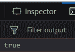
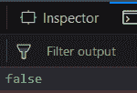
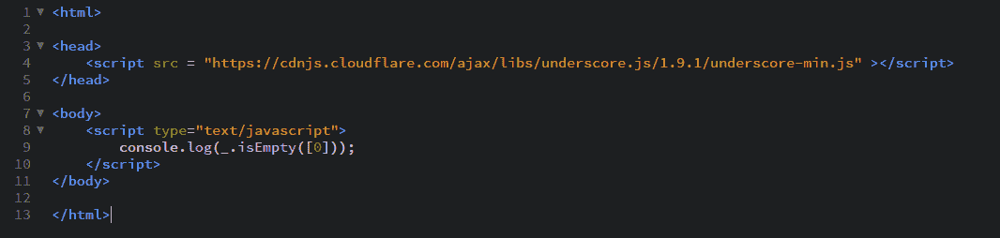

# 下划线. js _。isEmpty()功能

> 原文:[https://www . geesforgeks . org/下划线-js-_-isempty-function/](https://www.geeksforgeeks.org/underscore-js-_-isempty-function/)

**_。isEmpty()函数:**

*   用于检查列表、数组、字符串、对象等是否为空。
*   它首先找出传递的参数的长度，然后决定。
*   如果长度为零，则输出为真，否则为假。

**语法:**

```
_.isEmpty(object)
```

**参数:**
只需要一个参数，就是对象。

**返回值:**
如果传递的参数为空，即其中没有任何元素，则返回 true。否则返回假。

**示例:**

1.  **Passing an empty element to the _.isEmpty() function:**
    The _.isEmpty() function takes the element from the list one by one and starts counting the length of the array. Each time it encounters an element, it increments length by one. Then, when the array finishes, it checks if the array’s length is zero ( it returns true) or greater than zero (then, it returns false). Here, we have an empty array so the output will be true.

    ```
    <!-- Write HTML code here -->
    <html>

    <head>
        <script src = 
        "https://cdnjs.cloudflare.com/ajax/libs/underscore.js/1.9.1/underscore-min.js">
         </script>
    </head>

    <body>
        <script type="text/javascript">
            console.log(_.isEmpty([]));
        </script>
    </body>

    </html>
    ```

    **输出:** 

2.  **Passing an array with 6 elements to the _.isEmpty() function:**
    The procedure for the check function will be same as in the above example. Here, we have 6 elements in the array which implies that at the finish of the array, it’s length will be 6\. so, the length is not equal to 0 and hence the answer will be false.

    ```
    <!-- Write HTML code here -->
    <html>

    <head>
        <script src = 
        "https://cdnjs.cloudflare.com/ajax/libs/underscore.js/1.9.1/underscore-min.js">
        </script>
    </head>

    <body>
        <script type="text/javascript">
            console.log(_.isEmpty([1, 2, 3, 4, 5, 6]));
        </script>
    </body>

    </html>
    ```

    **输出:** 

3.  **Passing a list of characters to _.isEmpty() function:**
    The _.isEmpty() function will work the same as in the examples above. It implies that it does not distinguish between whether the array has numbers, characters or is empty. It will work the same on all the array and find out their length. In this example we have an array of length 4\. Hence, the output will be false.

    ```
    <html>

    <head>
        <script src = 
        "https://cdnjs.cloudflare.com/ajax/libs/underscore.js/1.9.1/underscore-min.js">
         </script>
    </head>

    <body>
        <script type="text/javascript">
            console.log(_.isEmpty(['HTML', 'CSS', 'JS', 'AJAX']));
        </script>
    </body>

    </html>
    ```

    **输出:** 

4.  **Passing an element zero to the _.isEmpty() function:**
    Do not get confused with the empty array and an array containing zero as an element. Since the elements is zero, so you must be thinking that the array is empty. But the array contains an element and since the _isEmpty() calculates the length, therefore the length of the below array will be one which is greater than zero. And hece the output will be false.

    ```
    <!-- Write HTML code here -->

    <html>

    <head>
        <script src = 
        "https://cdnjs.cloudflare.com/ajax/libs/underscore.js/1.9.1/underscore-min.js">
         </script>
    </head>

    <body>
        <script type="text/javascript">
            console.log(_.isEmpty([0]));
        </script>
    </body>

    </html>
    ```

    **输出:** 

    `

**注意:**
这些命令在 Google 控制台或 firefox 中无法工作，因为这些额外的文件需要添加，而它们没有添加。
因此，将给定的链接添加到您的 HTML 文件中，然后运行它们。
链接如下:

```
<!-- Write HTML code here -->
<script type="text/javascript" src =
"https://cdnjs.cloudflare.com/ajax/libs/underscore.js/1.9.1/underscore-min.js">
</script>
```

举例如下:
