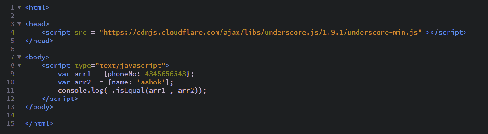

# 下划线. js _。isEqual()功能

> 原文:[https://www . geesforgeks . org/下划线-js-_-isequal-function/](https://www.geeksforgeeks.org/underscore-js-_-isequal-function/)

**_。isEqual()函数:**用于查找给定的 2 个数组是否相同。如果两个数组具有相同数量的元素，则它们是相同的，属性和值都需要相同。在数组的元素未知并且我们想要检查它们是否相同的情况下，这可能是有益的。

**语法:**

```
_.isEqual(object, other)
```

**参数:**
需要两个参数:

*   **对象:**对象可以是数组。
*   **其他:**另一个阵守住。

**返回值:**
如果传递的数组相同，则返回真，否则返回假。

**示例:**

1.  **Passing 2 simple arrays to the _.isEqual() function:**
    The _.isEqual() function takes the element from the list of one array and searches it in the other array. If that property is found with the same value in the other array then it just goes on to checks the other property otherwise it just returns false. In this it checks for both the character values and the number values in the property.

    ```
    <!-- Write HTML code here -->
    <html>

    <head>
       <script src = 
    "https://cdnjs.cloudflare.com/ajax/libs/underscore.js/1.9.1/underscore-min.js">
       </script>
    </head> 
    <body>
        <script type="text/javascript">
            var arr1 = {name: 'akash', numbers: [3, 7, 14]};
            var arr2  = {name: 'akash', numbers: [3, 7, 14]};
            console.log(_.isEqual(arr1, arr2));
        </script>
    </body>

    </html>
    ```

    **输出:** 

2.  **Passing an array with more properties to the _.isEqual() function:**
    An array can have as many properties ad it has to act as an parameter to this function. Like here both the arrays contain 3 properties each of type character and date. The _.isEqual() function will work in the same way as for the above example. Since, both the arrays have same properties and the same values so, the output will be ‘true’.

    ```
    <!-- Write HTML code here -->
    <html>

    <head>
        <script src = 
        "https://cdnjs.cloudflare.com/ajax/libs/underscore.js/1.9.1/underscore-min.js">
        </script>
    </head>

    <body>
        <script type="text/javascript">
            var arr1 = {name: 'akash', gender: ['male'], birthDate: [03/22/99]};
            var arr2  = {name: 'akash', gender: ['male'], birthDate: [03/22/99]};
            console.log(_.isEqual(arr1, arr2));
        </script>
    </body>

    </html>
    ```

    **输出:** 

3.  **Passing 2 empty arrays to the _.isEqual() function:**
    The _.isEqual() function will try to check all the array properties along with their values. Since, both the array does not have any property so, there is nothing to match. And hence, both the arrays are equal. Therefore, the answer will be true.

    ```
    <html>

    <head>
        <script src = 
        "https://cdnjs.cloudflare.com/ajax/libs/underscore.js/1.9.1/underscore-min.js">
         </script>
    </head>

    <body>
        <script type="text/javascript">
            var arr1 = {};
            var arr2  = {};
            console.log(_.isEqual(arr1, arr2));
        </script>
    </body>

    </html>
    ```

    **输出:** 

4.  **Passing arrays with different properties to the _.isEqual() function:**
    If we pass arrays containing different properties then this function will work the same way. It will take the property of first parameter array ( here, ‘name’) and try to find it in the next array. But since, the other array does not have this property so the output will be ‘false’.

    ```
    <!-- Write HTML code here -->

    <html>

    <head>
        <script src = 
        "https://cdnjs.cloudflare.com/ajax/libs/underscore.js/1.9.1/underscore-min.js">
        </script>
    </head>

    <body>
        <script type="text/javascript">
            var arr1 = {phoneNo: 4345656543};
            var arr2  = {name: 'ashok'};
            console.log(_.isEqual(arr1, arr2));
        </script>
    </body>

    </html>
    ```

    **输出:** 

    `

**注意:**
这些命令在 Google 控制台或 firefox 中无法工作，因为这些额外的文件需要添加，而它们没有添加。
因此，将给定的链接添加到您的 HTML 文件中，然后运行它们。
链接如下:

```
<!-- Write HTML code here -->
<script type="text/javascript" src =
"https://cdnjs.cloudflare.com/ajax/libs/underscore.js/1.9.1/underscore-min.js">
</script>
```

举例如下:
