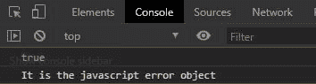
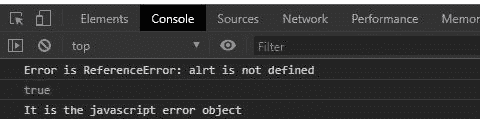

# 下划线. js _。isError()功能

> 原文:[https://www . geesforgeks . org/下划线-js-_-iserror-function/](https://www.geeksforgeeks.org/underscore-js-_-iserror-function/)

**下划线. js** 是 javascript 中的一个库，使得对数组、字符串、对象的操作变得更加容易和便捷。_ **。isError()** 函数用于检查给定对象是否为 javascript Error Object。

**注意:**在浏览器中使用下划线功能之前，链接下划线 CDN 是非常必要的。当链接下划线时，“_”作为一个全局变量附加到浏览器中。

**语法:**

```
_.isError(object);

```

**参数:**只取一个参数即对象。

**返回:**返回布尔值。如果对象是 javascript 的“从错误继承”对象，它将返回 true，否则函数将返回 false。

为了更好地理解函数，下面给出了几个例子。

**示例 1:** 从错误对象创建错误时

```
<!DOCTYPE html> 
<html> 
  <head> 
    <script src =  
"https://cdnjs.cloudflare.com/ajax/libs/underscore.js/1.9.1/underscore-min.js" > 
    </script> 
   </head> 
  <body>
    <script>
      let e=new Error()
      let ans=_.isError(e)
      console.log(_.isError(e))
      if(ans)
      console.log("It is the javascript error")
    </script>
  </body> 
</html>
```

**输出:**



**例 2:** 当尝试接球用于投掷失误时。

```
<!DOCTYPE html> 
<html> 
  <head> 
    <script src =  
"https://cdnjs.cloudflare.com/ajax/libs/underscore.js/1.9.1/underscore-min.js" > 
    </script> 
   </head> 
  <body>
    <script>
      let e;
      try{
        alrt("GeeksforGeeks")
      }
      catch(e){
        let ans=_.isError(e)
        console.log(`Error is ${e}`)
        console.log(_.isError(e))
        if(ans)
        console.log("It is the javascript error object")
      }
    </script>
  </body> 
</html>
```

**输出:**



**例 3:** 当给定错误为字符串类型时。

```
<!DOCTYPE html> 
<html> 
  <head> 
    <script src =  
"https://cdnjs.cloudflare.com/ajax/libs/underscore.js/1.9.1/underscore-min.js" > 
    </script> 
   </head> 
  <body>
    <script>
      let e="some error"
      let ans=_.isError(e)
      console.log(_.isError(e))
      if(ans)
      console.log("It is the javascript error object")
      else
      console.log("It is not the javascript error object")
    </script>
  </body> 
</html>
```

**输出:**

