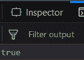

# 下划线. js _。isFinite()函数

> 原文:[https://www . geesforgeks . org/下划线-js-_-is inite-function/](https://www.geeksforgeeks.org/underscore-js-_-isfinite-function/)

**_。isFinite()函数**用于检查传递的参数值是否有限。如果参数具有无穷大的值，则输出为假，否则为真。在这个函数中，我们甚至可以执行任何操作，如加法、减法。

**语法:**

```
_.isFinite(object)
```

**参数:**
只需要一个参数，就是需要检查的参数。

**返回值:**
如果参数值有限，则返回真，否则返回假。

**例:**

1.  **Passing a positive number to the _.isFinite() function:**
    The _.isFinite() function takes the number that is passed to it. Since every number have a finite value, therefore when it will check it will declare it’s parameter passed as a finite variable. And hence the output will be false.

    ## 超文本标记语言

    ```
    <!-- Write HTML code here -->
    <html>

    <head>
        <script src = 
    "https://cdnjs.cloudflare.com/ajax/libs/underscore.js/1.9.1/underscore-min.js" >
        </script>
    </head>

    <body>
        <script type="text/javascript">
            console.log(_.isFinite(10));
        </script>
    </body>

    </html>
    ```

    **输出:** 

2.  **Passing a negative number to the _.isFinite() function:**
    The _.isFinite() function takes the number that is passed to it. Since, it is a negative number but still have a value so, for the same reason as above the _.isFinite() function will declare it’s parameter passed as a finite variable. And hence the output will be false.

    ## 超文本标记语言

    ```
    <!-- Write HTML code here -->
    <html>

    <head>
        <script src = 
    "https://cdnjs.cloudflare.com/ajax/libs/underscore.js/1.9.1/underscore-min.js" >
        </script>
    </head>

    <body>
        <script type="text/javascript">
            console.log(_.isFinite(-10));
        </script>
    </body>

    </html>
    ```

    **输出:** 

3.  **Passing a defined variable to the _.isFinite() function:**
    The _.isFinite() function takes the parameter passed to it which is variable ‘a’ here. Then it checks the value of ‘a’ which is 10\. It is not finite. Therefore, the answer is false.

    ## 超文本标记语言

    ```
    <!-- Write HTML code here -->
    <html>

    <head>
        <script src = 
    "https://cdnjs.cloudflare.com/ajax/libs/underscore.js/1.9.1/underscore-min.js" >
        </script>
    </head>

    <body>
        <script type="text/javascript">
            var a=1000;
            console.log(_.isFinite(a));
        </script>
    </body>

    </html>
    ```

    **输出:** 

4.  **Passing a variable without initializing to the _.isFinite() function:**
    The _.isFinite() function takes the parameter passed to it which is variable ‘a’ here. Then it checks the value of ‘a’ which is not defined and hence is not fixed. It means ‘a’ has infinite values. Therefore, the answer is true.

    ## 超文本标记语言

    ```
    <!-- Write HTML code here -->
    <html>

    <head>
        <script src = 
    "https://cdnjs.cloudflare.com/ajax/libs/underscore.js/1.9.1/underscore-min.js" >
       </script>
    </head>

    <body>
        <script type="text/javascript">
            var a;
            console.log(_.isFinite(a));
        </script>
    </body>

    </html>
    ```

    **输出:** 

**注意:**这些命令在 Google console 或 firefox 中无法工作，因为需要添加这些他们没有添加的附加文件。
所以，添加给定的链接到你的 HTML 文件，然后运行它们。
链接如下:

## 超文本标记语言

```
<!-- Write HTML code here -->
<script type="text/javascript" src =
"https://cdnjs.cloudflare.com/ajax/libs/underscore.js/1.9.1/underscore-min.js">
</script>
```