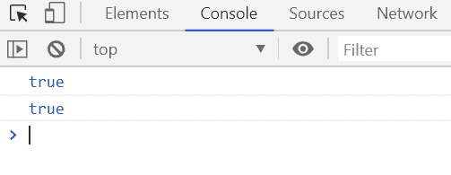
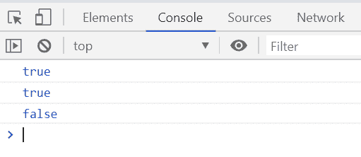

# 下划线. js | _。isFunction()函数

> 原文:[https://www . geesforgeks . org/下划线-js-_-isfunction-function/](https://www.geeksforgeeks.org/underscore-js-_-isfunction-function/)

**_。isFunction()函数**用于检查给定对象是否是函数。如果给定的对象是函数，则返回布尔值“真”，否则返回“假”。

**语法:**

```
_.isFunction( object )
```

**参数:**该功能接受如上所述的单个参数，描述如下:

*   **对象:**包含需要检查对象是否是功能的对象的值。

**返回值:**如果给定对象是函数，则返回真，否则返回假。

**例 1:**

```
<!DOCTYPE html>
<html>

<head>
    <script type="text/javascript" 
            src=
"https://cdnjs.cloudflare.com/ajax/libs/underscore.js/1.9.1/underscore-min.js">
    </script>
</head>

<body>
    <script type="text/javascript">

        console.log(_.isFunction(function (element) {
            return element % 2 != 0;
        }));

        console.log(_.isFunction(function (n) {
            return n < 2 ? n : fib(n - 1) + fib(n - 2);
        }));
    </script>
</body>

</html>
```

**输出:**


**例 2:**

```
<!DOCTYPE html>
<html>

<head>
    <script type="text/javascript" 
            src=
"https://cdnjs.cloudflare.com/ajax/libs/underscore.js/1.9.1/underscore-min.js">
    </script>
</head>

<body>
    <script type="text/javascript">

        console.log(_.isFunction(alert));
        console.log(_.isFunction(console.log));
        console.log(_.isFunction('GeeksgorGeeks'));
    </script>
</body>

</html>
```

**输出:**
