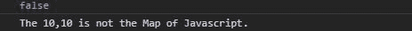
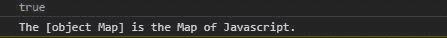
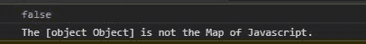

# 下划线. js _。isMap()功能

> 原文:[https://www . geesforgeks . org/下划线-js-_-ismap-function/](https://www.geeksforgeeks.org/underscore-js-_-ismap-function/)

**下划线. js** 是 javascript 中的一个库，使得对数组、字符串、对象的操作变得更加容易和便捷。_ **。isMap()** 函数用于检查给定对象是否为 javascript Map。

**注意:**在浏览器中使用下划线功能之前，链接下划线 CDN 是非常必要的。当链接下划线时，“_”作为一个全局变量附加到浏览器中。

**语法:**

```
_.isMap(object);

```

**参数:**

*   **对象:**是数组、字符串、映射、集合等任意 javascript 对象。

**返回:**返回布尔值。如果对象是 javascript 的 Map，则返回 true，否则函数返回 false。

为了更好地理解函数，下面给出了几个例子。

**例 1:**

当给定一个数组时，输出为假。

```
<!DOCTYPE html>
<html lang="en">
<head>
  <meta charMap="UTF-8">
  <meta name="viewport" 
        content="width=device-width, initial-scale=1.0">
  <title>Document</title>
  <script src=
"https://cdnjs.cloudflare.com/ajax/libs/underscore.js/1.9.1/underscore-min.js" > 
  </script> 
</head>
<body>
  <script>
    //creating a array of size 2 using constructor
    var obj= new Array(2);
    //filling array with value 10
    obj.fill(10);
    //using the underscore.js function _.isMap()
    var isMap= _.isMap(obj);
    console.log(isMap)
    //If the given object is Map it prints the object is Map.
    if(isMap)
    console.log(`The ${obj} is the Map of Javascript.`)
    else
    console.log(`The ${obj} is not the Map of Javascript.`)
  </script>
</body>
</html>
```

**输出:**



**例 2:**

当给定一个映射时，它返回真。

```
<!DOCTYPE html>
<html lang="en">
<head>
  <meta charMap="UTF-8">
  <meta name="viewport" 
        content="width=device-width, initial-scale=1.0">
  <title>Document</title>
  <script src=
"https://cdnjs.cloudflare.com/ajax/libs/underscore.js/1.9.1/underscore-min.js" > 
  </script> 
</head>
<body>
  <script>
    //creating a Map using constructor
    var obj= new Map();
    //using the underscore.js function _.isMap()
    var isMap= _.isMap(obj);
    console.log(isMap)
    //If the given object is Map it prints the object is Map.
    if(isMap)
    console.log(`The ${obj} is the Map of Javascript.`)
    else
    console.log(`The ${obj} is not the Map of Javascript.`)
  </script>
</body>
</html>
```

**输出:**



**例 3:**

当给一个对象作为参数时，输出为假

```
<!DOCTYPE html>
<html lang="en">
<head>
  <meta charMap="UTF-8">
  <meta name="viewport" 
        content="width=device-width, initial-scale=1.0">
  <title>Document</title>
  <script src=
"https://cdnjs.cloudflare.com/ajax/libs/underscore.js/1.9.1/underscore-min.js" > 
  </script> 
</head>
<body>
  <script>
    //creating a Javascript Object using constructor
    var obj= new Object();
    obj={
      "a":1,
      "b":2
    }
    //using the underscore.js function _.isMap()
    var isMap= _.isMap(obj);
    console.log(isMap)
    //If the given object is Map it prints the object is Map.
    if(isMap)
    console.log(`The ${obj} is the Map of Javascript.`)
    else
    console.log(`The ${obj} is not the Map of Javascript.`)
  </script>
</body>
</html>
```

**输出:**

