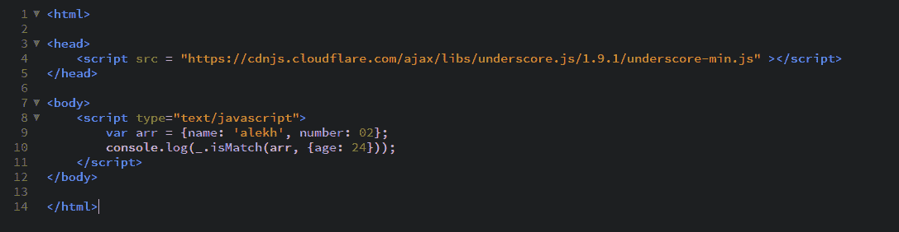

# 下划线. js _。isMatch()功能

> 原文:[https://www . geesforgeks . org/下划线-js-_-ismatch-function/](https://www.geeksforgeeks.org/underscore-js-_-ismatch-function/)

它 **_。isMatch()函数:**用于查找参数中给定的属性在传递的数组中是否存在。此外，属性的值应该相同，以便匹配。它用于我们想要找出数组是否满足特定条件的情况。

**语法:**

```
_.isMatch(object, properties)
```

**参数:**
需要两个参数:

*   对象/数组
*   有价值的财产

**返回值:**
如果属性及其值与传递的数组匹配，则返回真，否则返回假。

**示例:**

1.  **Passing a number property to the _.isMatch() function:**
    The _.isMatch() function takes property passed in the second argument and then tries to find that property in the array passed. If the property exists in the array definition it checks and matches it’s value both in the array definition and in the second parameter. If it matches then it returns true otherwise it returns false. If the property is not mentioned in the array definition then it will simply return false.

    ```
    <!-- Write HTML code here -->
    <html>

    <head>
        <script src = 
        "https://cdnjs.cloudflare.com/ajax/libs/underscore.js/1.9.1/underscore-min.js">
        </script>
    </head>

    <body>
        <script type="text/javascript">
            var arr = {name: 'alekh', number: 02};
            console.log(_.isMatch(arr, {number: 2}));
        </script>
    </body>

    </html>
    ```

    **输出:** 

2.  **Passing a character property to the _.isMatch() function:**
    It will work in the same way as the _.isMatch() function worked for the number property. Like here it will compare the strings given in the property. Here first it will check for the ‘name’ property and then it will match the name mentioned in the second parameter, i.e., ‘alekh’ to the name property in the array definition which is also ‘alekh’. Hence, the output will be true.

    ```
    <!-- Write HTML code here -->
    <html>

    <head>
        <script src = 
        "https://cdnjs.cloudflare.com/ajax/libs/underscore.js/1.9.1/underscore-min.js">
         </script>
    </head>

    <body>
        <script type="text/javascript">
            var arr = {name: 'alekh', number: 02};
            console.log(_.isMatch(arr, {name: 'alekh'}));
        </script>
    </body>

    </html>
    ```

    **输出:** 

3.  **Passing an empty array to the _.isMatch() function:**
    The _.isMatch() function will see that no property is passed in the second parameter and hence will not check ahead and will simply return a true. It does not need to worry about the other properties mentioned in the array definition.

    ```
    <html>

    <head>
        <script src = 
        "https://cdnjs.cloudflare.com/ajax/libs/underscore.js/1.9.1/underscore-min.js">
        </script>
    </head>

    <body>
        <script type="text/javascript">
            var arr = {};
            console.log(_.isMatch(arr, {}));
        </script>
    </body>

    </html>
    ```

    **输出:** 

4.  **Passing a property which is not mentioned in the array definition to the _.isMatch() function:**
    If we pass the second parameter which is not mentioned in the array definition then the output will be false. This is because, the _.isMatch() function will not have any property in the definition to match from and hence the output will be false finally.

    ```
    <!-- Write HTML code here -->
    <html>

    <head>
        <script src = 
        "https://cdnjs.cloudflare.com/ajax/libs/underscore.js/1.9.1/underscore-min.js">
        </script>
    </head>

    <body>
        <script type="text/javascript">
            var arr = {name: 'alekh', number: 02};
            console.log(_.isMatch(arr, {age: 24}));
        </script>
    </body>

    </html>
    ```

    **输出:** 

    `

**注意:**
这些命令在 Google 控制台或 firefox 中无法工作，因为这些额外的文件需要添加，而它们没有添加。
因此，将给定的链接添加到您的 HTML 文件中，然后运行它们。
链接如下:

```
<!-- Write HTML code here -->
<script type="text/javascript" src =
"https://cdnjs.cloudflare.com/ajax/libs/underscore.js/1.9.1/underscore-min.js">
</script>
```

举例如下:
