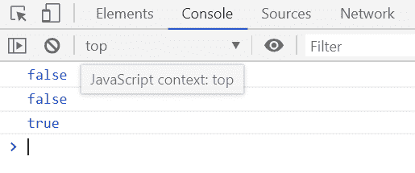
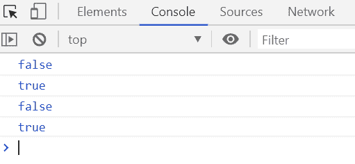

# 下划线. js _。isNumber()函数

> 原文:[https://www . geesforgeks . org/下划线-js-_-isnumber-function/](https://www.geeksforgeeks.org/underscore-js-_-isnumber-function/)

**_。isNumber()函数**用于检查给定的对象参数是否为数字。如果给定的对象是一个数字，则返回真值，否则返回假值。

**语法:**

```
_.isNumber( object )
```

**参数:**该函数接受一个参数，如上所述，如下所述:

*   **对象:**此参数保存需要检查是否为数字的对象元素。

**返回值:**如果给定对象是数字，则返回真，否则返回假。

**例 1:**

```
<!DOCTYPE html>
<html>

<head>
    <script type="text/javascript" src=
"https://cdnjs.cloudflare.com/ajax/libs/underscore.js/1.9.1/underscore-min.js">
    </script>
</head>

<body>
    <script type="text/javascript">

        var arr = [0, 1, 2, 3, 4, 5, 6, 7, 8, 9];
        console.log(_.isNumber(arr));

        var fun = function (element) {
            return element % 2 != 0;
        };
        console.log(_.isNumber(fun));

        var str = 'GeeksforGeeks';
        console.log(_.isNumber(str.length));
    </script>
</body>

</html>
```

**输出:**


**例 2:**

```
<!DOCTYPE html>
<html>

<head>
    <script type="text/javascript" src=
"https://cdnjs.cloudflare.com/ajax/libs/underscore.js/1.9.1/underscore-min.js">
    </script>
</head>

<body>
    <script type="text/javascript">

        console.log(_.isNumber(true));
        console.log(_.isNumber(10));
        console.log(_.isNumber('GeeksforGeeks'));
        console.log(_.isNumber(15.675));
    </script>
</body>

</html>
```

**输出:**
