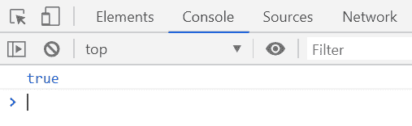
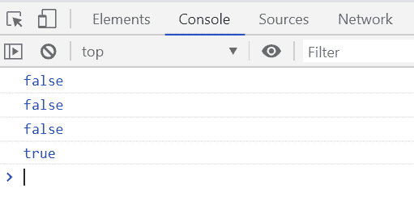

# 下划线. js | _。isObject()函数

> 原文:[https://www . geesforgeks . org/下划线-js-_-isobject-function/](https://www.geeksforgeeks.org/underscore-js-_-isobject-function/)

**_。isObject()函数**用于检查给定对象是否为对象。如果给定的对象元素是对象，则返回布尔值“真”，否则返回“假”。JavaScript 函数和数组是对象，而字符串和数字不是对象。

**语法:**

```
_.isObject( value )
```

**参数:**该函数接受一个参数，如上所述，如下所述:

*   **对象:**此参数保存需要检查是否为对象的对象的值。

**返回值:**如果给定的对象元素是对象，则返回真，否则返回假。

**例 1:**

```
<!DOCTYPE html>
<html>

<head>
    <script type="text/javascript" src=
"https://cdnjs.cloudflare.com/ajax/libs/underscore.js/1.9.1/underscore-min.js">
    </script>
</head>

<body>
    <script type="text/javascript">

        var info = {
            Company: { name: 'GeeksforGeeks' },
            Contact: { Address: { 
                AddressInfo: 'Noida', 
                ContNo: '+91 9876543210' 
            } }
        };

        console.log(_.isObject(info));
    </script>
</body>

</html>
```

**输出:**


**例 2:**

```
<!DOCTYPE html>
<html>

<head>
    <script type="text/javascript" src=
"https://cdnjs.cloudflare.com/ajax/libs/underscore.js/1.9.1/underscore-min.js">
    </script>
</head>

<body>
    <script type="text/javascript">

        console.log(_.isObject(true));
        console.log(_.isObject(1));
        console.log(_.isObject('GeeksforGeeks'));
        console.log(_.isObject([1, 2, 3]));
    </script>
</body>

</html>
```

**输出:**
