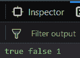

# 下划线. js _。isRegExp()功能

> 原文:[https://www . geesforgeks . org/下划线-js-_-isregexp-function/](https://www.geeksforgeeks.org/underscore-js-_-isregexp-function/)

**_。isRegExp()函数:**

*   它查找传递的对象是否是[正则表达式](https://www.geeksforgeeks.org/javascript-regular-expressions/)。
*   如果对象是正则表达式，则返回 true，否则返回 false。
*   我们甚至可以对变量进行加法等运算。isRegExp()被存储。

**语法:**

```
_.isRegExp(object)
```

**参数:**只需要一个参数，就是需要检查的对象。

**返回值:**如果传递的对象是正则表达式，则返回真，否则返回假。

**示例:**

1.  **Passing a regular expression to the _.isRegExp() function:** The _.isRegExp() function takes the element from it’s parameter and starts checking if it is a regular expression or not. Since the object starts and ends with ‘/’, therefore it is a regular expression. Hence, the result is true.

    ```
    <html>

    <head>
        <script src = 
    "https://cdnjs.cloudflare.com/ajax/libs/underscore.js/1.9.1/underscore-min.js" >
        </script>
    </head>

    <body>
        <script type="text/javascript">
            console.log(_.isRegExp(/geek/));
        </script>
    </body>

    </html>
    ```

    **输出:** 

2.  **Passing a string to the -.isRegExp() function:** In this we are passing a string to the _.isRegExp() and this can be identified as the parameter passed is inside the ‘ ‘ (quotes). Since a string is not a regular expression therefore, the output will be false.

    ```
    <html>

    <head>
        <script src = 
    "https://cdnjs.cloudflare.com/ajax/libs/underscore.js/1.9.1/underscore-min.js" >
        </script>
    </head>

    <body>
        <script type="text/javascript">
            console.log(_.isRegExp('geek'));
        </script>
    </body>

    </html>
    ```

    **输出:** 

3.  **Passing a string with ‘/’ to _.isRegExp() function:** The _.isRegExp() function takes the parameter which in this case is inside ‘ ‘, hence it is a string. Therefore, all the letters, symbols inside ‘ ‘ will behave as a string character. Hence the overall object is a string. Therefore, the output is false.

    ```
    <html>

    <head>
        <script src = 
    "https://cdnjs.cloudflare.com/ajax/libs/underscore.js/1.9.1/underscore-min.js" >
        </script>
    </head>

    <body>
        <script type="text/javascript">
            console.log(_.isRegExp('/geek/'));
        </script>
    </body>

    </html>
    ```

    **输出:** 

4.  **Applying addition operation on the _.isRegExp() function’s output:**
    In this we are storing the result of both the example 1 and 2 in the variables ‘a’ and ‘b’. Then we are applying addition operation on both the ‘a’ and ‘b’ variables. Since ‘a’ is true and ‘b’ is false, therefore, the addition of true and false will result in 1 which is then stored in ‘c’ variable.

    ```
    <html>

    <head>
        <script src = 
    "https://cdnjs.cloudflare.com/ajax/libs/underscore.js/1.9.1/underscore-min.js" >
        </script>
    </head>

    <body>
        <script type="text/javascript">
            var a=_.isRegExp(/geek/);
            var b=_.isRegExp('geek');
            var c=a+b;
            console.log(a, b, c);
        </script>
    </body>

    </html>
    ```

    **输出:** 

**注意:**这些命令在 Google console 或 firefox 中无法工作，因为需要添加这些他们没有添加的附加文件。因此，将给定的链接添加到您的 HTML 文件中，然后运行它们。链接如下:

```
<!-- Write HTML code here -->
<script type="text/javascript" src =
"https://cdnjs.cloudflare.com/ajax/libs/underscore.js/1.9.1/underscore-min.js">
</script>
```