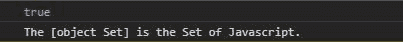
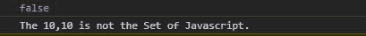

# 下划线. js _。isSet()功能

> 原文:[https://www . geesforgeks . org/下划线-js-_-isset-function/](https://www.geeksforgeeks.org/underscore-js-_-isset-fucntion/)

**下划线. js** 是 javascript 中的一个库，使得对数组、字符串、对象的操作变得更加容易和便捷。_ **。isSet()** 函数用于检查给定对象是否设置了 javascript。链接下划线时，**“_”**作为全局变量附加到浏览器。

**语法:**

```
_.isSet(object);
```

**参数:**

*   **对象:**是数组、字符串、映射、集合等任意 JavaScript 对象。

**返回:**返回布尔值。如果对象是一个 JavaScript 集，它将返回 true，否则函数将返回 false。

为了更好地理解函数，下面给出了几个例子。

**注意:**在浏览器中运行代码之前，需要链接到下划线. js 的 CDN。

**示例 1:** 当给定一个集合时，输出为真。

## 超文本标记语言

```
<!DOCTYPE html>
<html lang="en">
<head>
  <meta charMap="UTF-8">
  <meta name="viewport"
        content="width=device-width, initial-scale=1.0">
  <title>Document</title>
  <script src=
"https://cdnjs.cloudflare.com/ajax/libs/underscore.js/1.9.1/underscore-min.js" >
  </script>
</head>
<body>
  <script>
    //creating a set using constructor
    var obj= new Set();
    //using the underscore.js function _.isSet()
    var isSet= _.isSet(obj);
    console.log(isSet)
    //If the given object is Set it prints the object is set
    if(isSet)
    console.log(`The ${obj} is the Set of Javascript.`)
    else
    console.log(`The ${obj} is not the Set of Javascript.`)
  </script>
</body>
</html>
```

**输出:**



**示例 2:** 当给定一个数组时，它返回 False。

## 超文本标记语言

```
<!DOCTYPE html>
<html lang="en">
<head>
  <meta charMap="UTF-8">
  <meta name="viewport"
        content="width=device-width, initial-scale=1.0">
  <title>Document</title>
  <script src=
"https://cdnjs.cloudflare.com/ajax/libs/underscore.js/1.9.1/underscore-min.js" >
  </script>
</head>
<body>
  <script>
    //creating a array of size 2 using constructor
    var obj= new Array(2);
    //filling array with value 10
    obj.fill(10);
    //using the underscore.js function _.isSet()
    var isSet= _.isSet(obj);
    console.log(isSet)
    //If the given object is Set it prints the object is Set.
    if(isSet)
    console.log(`The ${obj} is the Set of Javascript.`)
    else
    console.log(`The ${obj} is not the Set of Javascript.`)
  </script>
</body>
</html>
```

**输出:**

