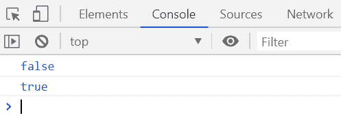
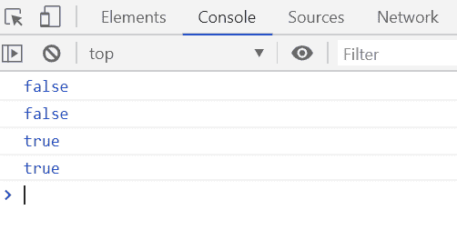

# 下划线. js | _。isString()函数

> 原文:[https://www . geesforgeks . org/下划线-js-_-isstring-function/](https://www.geeksforgeeks.org/underscore-js-_-isstring-function/)

**_。isString()函数**用于检查给定的对象元素是否为字符串。

**语法:**

```
_.isString( object )
```

**参数:**该功能接受如上所述的单个参数，描述如下:

*   **对象:**包含需要检查是否为字符串的对象的值。

**返回值:**如果给定的对象元素是字符串，则返回布尔值“真”，否则返回“假”。

**例 1:**

```
<!DOCTYPE html>
<html>

<head>
    <script type="text/javascript" 
            src=
"https://cdnjs.cloudflare.com/ajax/libs/underscore.js/1.9.1/underscore-min.js">
    </script>
</head>

<body>
    <script type="text/javascript">

        var info = {
            Company: 'GeeksforGeeks',
            Address: 'Noida',
            Contact: '+91 9876543210'
        };
        console.log(_.isString(info));

        var str = 'GeeksforGeeks';
        console.log(_.isString(str));
    </script>
</body>

</html>
```

**输出:**


**例 2:**

```
<!DOCTYPE html>
<html>

<head>
    <script type="text/javascript" 
            src=
"https://cdnjs.cloudflare.com/ajax/libs/underscore.js/1.9.1/underscore-min.js">
    </script>
</head>

<body>
    <script type="text/javascript">

        console.log(_.isString(true));
        console.log(_.isString(10));
        console.log(_.isString('GeeksforGeeks'));
        console.log(_.isString("20"));
    </script>
</body>

</html>
```

**输出:**
