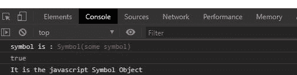
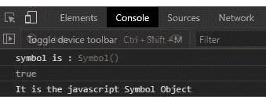
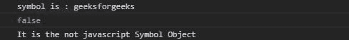

# 下划线. js _。isSymbol()函数

> 原文:[https://www . geesforgeks . org/下划线-js-_-issymbol-function/](https://www.geeksforgeeks.org/underscore-js-_-issymbol-function/)

**下划线. js** 是 javascript 中的一个库，使得对数组、字符串、对象的操作变得更加容易和便捷。_ **。isSymbol()** 函数用于检查给定对象是否为 javascript Symbol Object。

**注意:**在浏览器中使用下划线功能之前，链接下划线 CDN 是非常必要的。链接下划线时，“_”作为全局变量附加到浏览器。

**语法:**

```
_.isSymbol(object);
```

**参数:**只取一个参数即对象。

**返回:**返回布尔值。如果对象是 javascript 的符号对象，则返回 true，否则函数返回 false。

为了更好地理解函数，下面给出了几个例子。

**示例 1:** 当用某个值创建符号时。

## 超文本标记语言

```
<!DOCTYPE html> 
<html> 
  <head> 
    <script src =  
"https://cdnjs.cloudflare.com/ajax/libs/underscore.js/1.9.1/underscore-min.js" > 
    </script> 
   </head> 
  <body>
    <script>
      //creating new symbol from symbol object
      let e=Symbol("some symbol")
      let ans=_.isSymbol(e)
      console.log("symbol is :", e)
      console.log(_.isSymbol(e))
      if(ans)
      console.log("It is the javascript Symbol Object")
      else
      console.log("It is the not javascript Symbol Object")
    </script>
  </body> 
</html>
```

**输出:**



**示例 2:** 当没有给定对象的情况下创建符号时

## 超文本标记语言

```
<!DOCTYPE html> 
<html> 
  <head> 
    <script src =  
"https://cdnjs.cloudflare.com/ajax/libs/underscore.js/1.9.1/underscore-min.js" > 
    </script> 
   </head> 
  <body>
    <script>
      //creating new symbol from symbol object
      let e=Symbol()
      let ans=_.isSymbol(e)
      //printing the symbol
      console.log("symbol is :", e.valueOf(e))
      //printing true if this is the symbol else false
      console.log(_.isSymbol(e))
      if(ans)
      console.log("It is the javascript Symbol Object")
      else
      console.log("It is the not javascript Symbol Object")
    </script>
  </body> 
</html>
```

**输出:**



**例 3:** 当给定的对象是字符串时。

## 超文本标记语言

```
<!DOCTYPE html> 
<html> 
  <head> 
    <script src =  
"https://cdnjs.cloudflare.com/ajax/libs/underscore.js/1.9.1/underscore-min.js" > 
    </script> 
   </head> 
  <body>
    <script>
      //creating new string
      let e="geeksforgeeks"
      let ans=_.isSymbol(e)
      //printing the symbol
      console.log("symbol is :", e.valueOf(e))
      //printing true if this is the symbol else false
      console.log(_.isSymbol(e))
      if(ans)
      console.log("It is the javascript Symbol Object")
      else
      console.log("It is the not javascript Symbol Object")
    </script>
  </body> 
</html>
```

**输出:**

