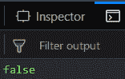

# 下划线. js | _。带示例的 isUndefined()

> 原文:[https://www . geesforgeks . org/下划线-js-_-is undefined-with-examples/](https://www.geeksforgeeks.org/underscore-js-_-isundefined-with-examples/)

**_。isUndefined()功能:**

*   它检查传递给它的参数是否未定义。
*   如果传递的参数未定义，则返回 true，否则返回 false。
*   我们甚至可以将窗口元素传递给它。

**语法:**

```
_.isUndefined(value)
```

**参数:**
只需要一个参数，就是需要检查的值或者变量。

**返回值:**
如果传递的值或参数未定义，则返回真，否则返回假。

**示例:**

1.  **Passing a variable to the _.isUndefined() function:**
    The _.isUndefined() function takes the parameter passed to it. So, here it will check the variable ‘a’ which is passed. Since the value of ‘a’ is defined earlier as 10, so, it is a defined variable. Hence, the output will be false.

    ```
    <!-- Write HTML code here -->
    <html>

    <head>
        <script src = 
     "https://cdnjs.cloudflare.com/ajax/libs/underscore.js/1.9.1/underscore-min.js" >
        </script>
    </head>

    <body>
        <script type="text/javascript">
            var a=10;
            console.log(_.isUndefined(a));
        </script>
    </body>

    </html>
    ```

    **输出:** 

2.  **Passing a number to the _.isUndefined() function:**
    If we pass a number to the _.isUndefined() function then it checks whether that number is undefined or not. Since, we know all numbers are defined already. Therefore, the answer will be false.

    ```
    <!-- Write HTML code here -->
    <html>

    <head>
        <script src = 
    "https://cdnjs.cloudflare.com/ajax/libs/underscore.js/1.9.1/underscore-min.js" >
        </script>
    </head>

    <body>
        <script type="text/javascript">
            console.log(_.isUndefined(10));
        </script>
    </body>

    </html>
    ```

    **输出:** 

3.  **Passing “undefined” to _.isUndefined() function:**
    The _.isUndefined() function takes the element passed to it which is “undefined” here. Since the parameter passed is undefined, therefore the output will be true.

    ```
    <!-- Write HTML code here -->
    <html>

    <head>
        <script src = 
    "https://cdnjs.cloudflare.com/ajax/libs/underscore.js/1.9.1/underscore-min.js" >
        </script>
    </head>

    <body>
        <script type="text/javascript">
            console.log(_.isUndefined(undefined));
        </script>
    </body>

    </html>
    ```

    **输出:** 

4.  **Passing missingVariable to the _.isUndefined() function:**
    Here we are passing ‘window.missingVariable’ as a parameter. But here we have not defined any variable. So the missingVariable has no value. And hence, it is undefined. The output is true.

    ```
    <!-- Write HTML code here -->
    <html>

    <head>
        <script src = 
    "https://cdnjs.cloudflare.com/ajax/libs/underscore.js/1.9.1/underscore-min.js" >
        </script>
    </head>

    <body>
        <script type="text/javascript">
            console.log(_.isUndefined(window.missingVariable));
        </script>
    </body>

    </html>
    ```

    **输出:** 

**注意:**这些命令在 Google console 或 firefox 中无法工作，因为需要添加这些他们没有添加的附加文件。
所以，添加给定的链接到你的 HTML 文件，然后运行它们。
链接如下:

```
<!-- Write HTML code here -->
<script type="text/javascript" src =
"https://cdnjs.cloudflare.com/ajax/libs/underscore.js/1.9.1/underscore-min.js">
</script>
```