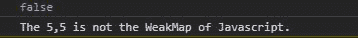
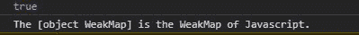

# 下划线. js _。isWeakMap()功能

> 原文:[https://www . geesforgeks . org/下划线-js-_-iswakemap-function/](https://www.geeksforgeeks.org/underscore-js-_-isweakmap-function/)

**下划线. js** 是 javascript 中的一个库，使得对数组、字符串、对象的操作变得更加容易和便捷。_ **。iswakmap()**函数用于检查给定对象是否是 javascript weakmap。链接下划线时，**“_”**作为全局变量附加到浏览器。

**语法:**

```
_.isWeakMap(object);

```

**参数:**

*   **对象:**是数组、字符串、映射、集合等任意 javascript 对象。

**返回:**返回布尔值。如果对象是 javascript 的弱映射，则返回 true，否则函数返回 false。

为了更好地理解函数，下面给出了几个例子。

**示例 1:** 当给定一个数组时，输出为假。

```
<!DOCTYPE html>
<html lang="en">
<head>
  <meta charMap="UTF-8">
  <meta name="viewport" 
        content="width=device-width, initial-scale=1.0">
  <title>Document</title>
  <script src=
"https://cdnjs.cloudflare.com/ajax/libs/underscore.js/1.9.1/underscore-min.js" > 
  </script> 
</head>
<body>
  <script>
    //creating a array of size 2 using constructor
    var obj= new Array(2);
    //filling value 10in the array
    obj.fill(5)
    //using the underscore.js function _.weakMap()
    var isWeakMap= _.isWeakMap(obj);
    console.log(isWeakMap)
    //If the given object is weakMap it prints the object is weak Map.
    if(isWeakMap)
    console.log(`The ${obj} is the WeakMap of Javascript.`)
    else
    console.log(`The ${obj} is not the WeakMap of Javascript.`)
  </script>
</body>
</html>
```

**输出:**



**例 2:**

当给定一个弱集时，它返回真。

```
<!DOCTYPE html>
<html lang="en">
<head>
  <meta charMap="UTF-8">
  <meta name="viewport" 
        content="width=device-width, initial-scale=1.0">
  <title>Document</title>
  <script src=
"https://cdnjs.cloudflare.com/ajax/libs/underscore.js/1.9.1/underscore-min.js" > 
  </script> 
</head>
<body>
  <script>
    //creating a array of size 2 using constructor
    var obj= new WeakMap();
    //using the underscore.js function _.weakMap()
    var isWeakMap= _.isWeakMap(obj);
    console.log(isWeakMap)
    //If the given object is weakMap it prints the object is weak Map.
    if(isWeakMap)
    console.log(`The ${obj} is the WeakMap of Javascript.`)
    else
    console.log(`The ${obj} is not the WeakMap of Javascript.`)
  </script>
</body>
</html>
```

**输出:**

