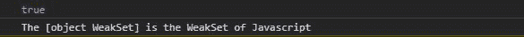
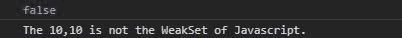

# 下划线. js _。isWeakSet()功能

> 原文:[https://www . geesforgeks . org/下划线-js-_-iswakeset-function/](https://www.geeksforgeeks.org/underscore-js-_-isweakset-function/)

**下划线. js** 是一个 JavaScript 库，使得对数组、字符串、对象的操作变得更加容易和便捷。
他 **_。函数的作用是:检查给定的对象是否是 JavaScript weakset。链接下划线. js CDN 时，**“_”**作为全局变量附加到浏览器。**

**语法:**

```
_.isWeakSet( object );
```

**参数:**

*   **对象:**是数组、字符串、映射、集合等任意 JavaScript 对象。

**返回值:**返回布尔值。如果集合是弱集合，则返回 true，否则返回 false。

**例 1:** 当给定一个弱集时，它返回真。

```
<!DOCTYPE html>
<html lang="en">

<head>
    <meta charset="UTF-8">
    <meta name="viewport" content=
        "width=device-width, initial-scale=1.0">

    <script src=
"https://cdnjs.cloudflare.com/ajax/libs/underscore.js/1.9.1/underscore-min.js">
    </script>
</head>

<body>
    <script>

        // Creating a weak set using
        // constructor
        var obj = new WeakSet();

        // Using the _.weakSet() function
        var isWeakSet = _.isWeakSet(obj);
        console.log(isWeakSet)

        // If the given object is weakset 
        // it prints the object is weak set.
        if (isWeakSet)
            console.log(`The ${obj} is the 
                    WeakSet of Javascript.`)
        else
            console.log(`The ${obj} is not 
                the WeakSet of Javascript.`)
    </script>
</body>

</html>
```

**输出:**


**示例 2:** 当给定一个数组时，输出为假。

```
<!DOCTYPE html>
<html lang="en">

<head>
    <meta charset="UTF-8">
    <meta name="viewport" content=
        "width=device-width, initial-scale=1.0">

    <script src=
"https://cdnjs.cloudflare.com/ajax/libs/underscore.js/1.9.1/underscore-min.js">
    </script>
</head>

<body>
    <script>

        // Creating a array of size 
        // 2 using constructor
        var obj = new Array(2);

        // Filling value 10in the array
        obj.fill(10)

        // Using the _.weakSet() function
        var isWeakSet = _.isWeakSet(obj);
        console.log(isWeakSet)

        // If the given object is weakset 
        // it prints the object is weak set
        if (isWeakSet)
            console.log(`The ${obj} is the
                WeakSet of Javascript.`)
        else
            console.log(`The ${obj} is not 
                the WeakSet of Javascript.`)
    </script>
</body>

</html>
```

**输出:**
