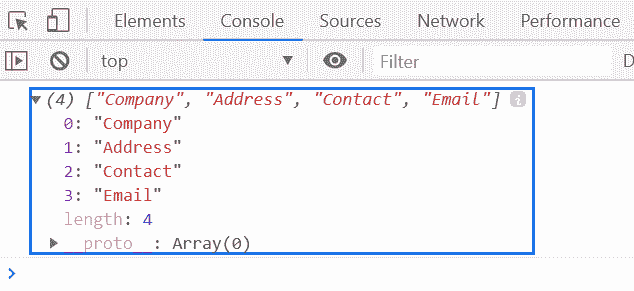
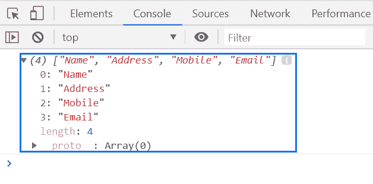

# 下划线. js _。按键()功能

> 原文:[https://www . geesforgeks . org/下划线-js-_-键-函数/](https://www.geeksforgeeks.org/underscore-js-_-keys-function/)

**_。keys()** 函数用于返回给定对象的所有键的列表。

**语法:**

```
_.keys( object )
```

**参数:**该函数接受如上所述的单个参数，如下所述:

*   **对象:**包含对象元素。

**返回值:**该函数返回给定对象的所有键的列表。

下面的例子说明了 **_。Keys()** 在下划线中的作用
**示例 1:**

```
<!DOCTYPE html>
<html>

<head>
    <script type="text/javascript" src=
"https://cdnjs.cloudflare.com/ajax/libs/underscore.js/1.9.1/underscore-min.js">
    </script>
</head>

<body>
    <script type="text/javascript">

        var obj = {
            Company: "GeeksforGeeks",
            Address: "Noida",
            Contact: "+91 9876543210",
            Email: "abc@gfg.com"
        }
        console.log(_.keys(obj));
    </script>
</body>

</html>
```

**输出:**


**例 2:**

```
<!DOCTYPE html>
<html>

<head>
    <script type="text/javascript" src=
"https://cdnjs.cloudflare.com/ajax/libs/underscore.js/1.9.1/underscore-min.js">
    </script>
</head>

<body>
    <script type="text/javascript">

        var key = _.keys({
            Name: "Ashok",
            Address: "Noida",
            Mobile: "+91 9876543210",
            Email: "geeks@gmail.com"
        });

        console.log(key);
    </script>
</body>

</html>
```

**输出:**
