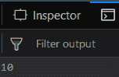
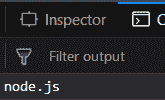
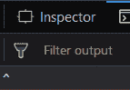

# 下划线. js _。最后()功能

> 原文:[https://www . geesforgeks . org/下划线-js-_-last-function/](https://www.geeksforgeeks.org/underscore-js-_-last-function/)

下划线. js 是一个 JavaScript 库，它提供了很多有用的功能，比如映射、过滤、调用等，甚至不使用任何内置对象。
The _。last()用于显示数组的最后一个元素。它通常用于将一个数组的元素分成两个数组。一个只包含最后一个元素，另一个包含除最后一个元素以外的所有元素。

**语法:**

```
_.last( array, [n] ) 
```

**参数:**该函数接受两个参数，如下所示:

*   **数组:**此参数用于保存数组元素。
*   **n:** 此参数用于保存最后一个元素。

**返回值:**返回数组的最后一个元素。

**将数字数组传递给 _。last()函数:** The。_last()函数从列表中逐个获取元素并忽略它们。它只从数组中取出最后一个元素并返回。

**示例:**

```
<!DOCTYPE html>
<html>
    <head>
        <script src = 
"https://cdnjs.cloudflare.com/ajax/libs/underscore.js/1.9.1/underscore-min.js" >
        </script>
    </head>
    <body>
        <script type="text/javascript">
            console.log(_.last([1, 2, 3, 4, 5, 6, 7, 8, 9, 10]));
        </script>
    </body>
</html>
```

**输出:**


**将字母/单词数组传递给 _。last()函数:** The。_last()函数从列表中逐个获取元素并忽略它们。它不区分数字和单词数组。它只从数组中取出最后一个元素并返回。然后最后 console.log()将显示最后一个元素。

**示例:**

```
<!DOCTYPE html>
<html>
    <head>
        <script src = 
"https://cdnjs.cloudflare.com/ajax/libs/underscore.js/1.9.1/underscore-min.js" >
        </script>
    </head>
    <body>
        <script type="text/javascript">
            console.log(_.last(['html', 'css', 'js',
                        'ajax', 'php', 'node.js']));
        </script>
    </body>
</html>                    
```

**输出:**


**将特殊字符数组传递给 _。last()函数:** The。_last()函数从列表中逐个获取元素并忽略它们。它也不区分特殊字符数组或数字数组或单词数组。它只从数组中取出最后一个元素并返回。

**示例:**

```
<!DOCTYPE html>
<html>
    <head>
        <script src = 
"https://cdnjs.cloudflare.com/ajax/libs/underscore.js/1.9.1/underscore-min.js" >
        </script>
    </head>
    <body>
        <script type="text/javascript">
            console.log(_.last(['!', '@', '#', '{content}apos;, '%', '^']));
        </script>
    </body>
</html>                    
```

**输出:**


**将异类数组传递给 _。last()函数:**异构数组是包含所有元素的数组。它也会以同样的方式工作。因为数组中包含了所有的元素”，所以它们被认为是字符元素。这就是为什么 _。initial()不区分数字、字符和特殊字符数组。

**示例:**

```
<!DOCTYPE html>
<html>
    <head>
        <script src =
"https://cdnjs.cloudflare.com/ajax/libs/underscore.js/1.9.1/underscore-min.js" >
        </script>
    </head>
    <body>
        <script type="text/javascript">
            console.log(_.last(['1', 'javascript', 
                        '#', '2', 'underscore', '^']));
        </script>
    </body>
</html>                    
```

**输出:**


**注意:**这些命令在 Google 控制台或 Firefox 中无法工作，因为需要添加这些他们没有添加的附加文件。因此，将给定的链接添加到您的 HTML 文件中，然后运行它们。

```
<script type="text/javascript" src = 
"https://cdnjs.cloudflare.com/ajax/libs/underscore.js/1.9.1/underscore-min.js"> 
</script> 
```