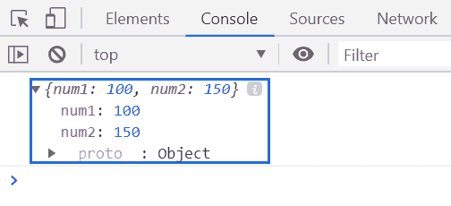
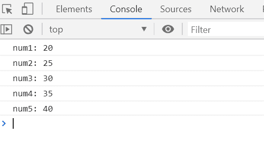

# 下划线. js _。mapObject()函数

> 原文:[https://www . geesforgeks . org/下划线-js-_-mapobject-function/](https://www.geeksforgeeks.org/underscore-js-_-mapobject-function/)

**_。mapObject()函数**类似于地图，但用于对象。该函数基于给定的函数/操作转换对象的每个值。

**语法:**

```
_.mapObject(object, iteratee, [context])
```

**参数:**该功能接受三个参数，如上所述，描述如下:

*   **对象:**包含保存键值对元素的对象元素。
*   **迭代:**是用来取列表中所有元素的函数，也记住了所有返回值。
*   **上下文:**此参数用于显示内容。

**返回值:**返回每个对象元素的变换值。

**例 1:**

```
<!DOCTYPE html>
<html>

<head>
    <script type="text/javascript" 
            src=
"https://cdnjs.cloudflare.com/ajax/libs/underscore.js/1.9.1/underscore-min.js">
    </script>
</head>

<body>
    <script type="text/javascript">

        var res = _.mapObject({ num1: 10, num2: 15 },
            function (value, key) {
                return value * 10;
            });

        console.log(res);
    </script>
</body>

</html>
```

**输出:**


**例 2:**

```
<!DOCTYPE html>
<html>

<head>
    <script type="text/javascript" 
            src=
"https://cdnjs.cloudflare.com/ajax/libs/underscore.js/1.9.1/underscore-min.js">
    </script>
</head>

<body>
    <script type="text/javascript">

        _.mapObject({ num1: 10, num2: 15, num3: 20, num4: 25, num5: 30 },

            function (value, key) {
                console.log(key + ': ' + (value + 10));
            });
    </script>
</body>

</html>
```

**输出:**
